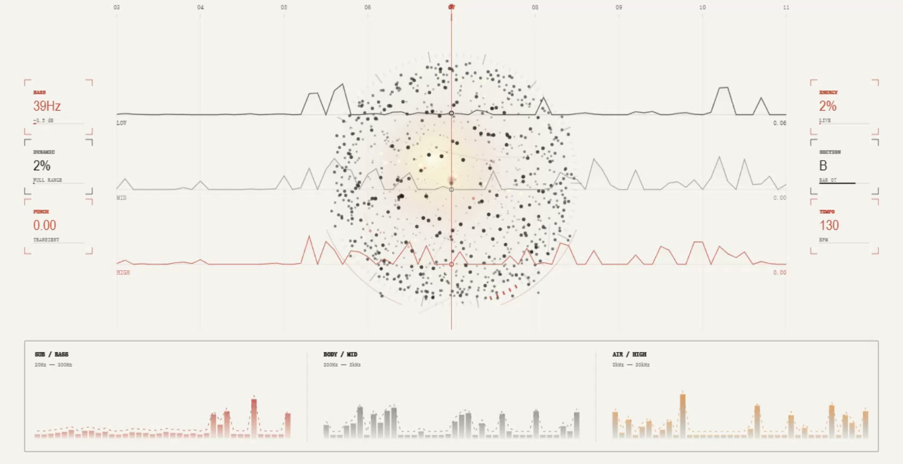

# BeatScope

[简体中文](README.md) | English

A local personal project that turns a song's rhythm into a playable visual reference and a reusable timing package for coding agents.

BeatScope lets you upload a track, play it in the browser, and watch a particle sphere, frequency traces, and a whole-song structure view respond to LOW, MID, HIGH, transients, and section changes. The same analysis is arranged into an eight-bar cue map and exported as a Codex package with its own <code>SKILL.md</code>, so the next visual project does not have to guess the timing of the same song again.

**[Watch the 10-second demo with sound](docs/demo/beatscope-demo.mp4)**

> BeatScope reports rhythm strength, frequency distribution, and timing structure. It does not present uncertain transients as kicks, snares, or 808s. Audio is analysed locally and request-scoped temporary files are removed after processing.

## Why I built it

The difficult part of music visualisation is usually not drawing a shape that moves. It is deciding why it should move at this exact moment, how far it should move, and how the same animation should behave when two songs have completely different rhythmic density.

A direct peak-to-explosion mapping works for sparse music and quickly falls apart on a dense track. Looking only at total volume loses low-frequency weight, high-frequency detail, and section changes. Handing the same song to another agent later also means repeating those decisions from the beginning.

BeatScope keeps that work. Python reads the audio, builds the beat grid, and extracts multiband energy. The browser uses <code>audio.currentTime</code> as its only clock. The particle system separates ordinary pulse, sustained turbulence, local impact, and rare hero events. The result can be watched directly or reused as timing evidence in the next creative build.

## What one session looks like

~~~text
Upload local audio → build beats and multiband energy
                   → move into the Signal player
                   → play, seek, and inspect whole-song structure
                   → audition or loop an eight-bar cue range
                   → export a Codex package for the next visual project
~~~

1. Choose a WAV, FLAC, MP3, OGG, or M4A file.
2. The local service derives beats, transients, LOW / MID / HIGH energy, and a structural overview.
3. The page moves into the player, where the particle sphere, traces, and spectrum follow playback.
4. Track structure provides a whole-song view and direct navigation.
5. The eight-bar cue map translates the current window into impact, scale, flow, flash, and bloom references.
6. The Codex export preserves the analysis, a deterministic visual-state function, instructions, and a portable Skill.

More player states

### Quiet passage

### Dense passage

## More than a sphere that moves

### Track structure: see the whole song first

This navigator compresses the complete track into sections, LOW / MID / HIGH energy traces, and transient density. Clicking a bar seeks directly to it. The red frame always marks the eight bars currently shown in the cue map, so changes do not have to be found by scrubbing blindly through one long timeline.

### Eight-bar cue map: turn listening into usable timing

The same eight-bar window exposes IMPACT, LOW / SCALE, MID / FLOW, HIGH / FLASH, and ACCENT / BLOOM. This is not a drum transcription; it is a motion-oriented reference. A transient can be auditioned with one click, a loop can be dragged out, and the resulting timing, strength, and band drivers can be passed into the next visual build.

### Export for Codex: carry the analysis forward

The package contains more than analysis JSON. It also carries a seek-safe <code>visual-state.js</code>, usage notes, the schema, and a project-level <code>SKILL.md</code>. Drop the ZIP into a new Codex project and the agent can reuse the same timing and visual semantics instead of listening and guessing again.

## How music changes the scene

The player does not treat every strong beat as the same event. It compares transient strength and local density inside the current song, then spends a limited visual budget.

| Musical state | Visual response |
| --- | --- |
| Ordinary beat | Small sphere breath and short core response |
| Continuous strong rhythm | More surface motion and turbulence, without repeated explosions |
| Locally distinct transient | Limited particle separation and a short impact |
| Rare hit or section change | Full expansion when the cooldown allows it |
| LOW / MID / HIGH | Weight and scale, surface flow, detail and brightness |
| Playback position | One clock for particles, traces, structure, and cue map |

Particle count adapts to the measured render cost of a frame. The structure navigator and cue overlay update less often than the main instrument so they do not compete with recording performance; the audio clock itself is never downsampled.

## How the eight-bar reference works

BeatScope aligns raw transients to a 1/16 or 1/32 grid while keeping the real timestamp, quantised position, and offset. It exposes timing facts rather than asking the user to trust an instrument label:

| Cue | Suggested visual direction |
| --- | --- |
| IMPACT | A short geometry, camera, or composition impulse |
| LOW / SCALE | Size, weight, and depth |
| MID / FLOW | Surface and directional movement |
| HIGH / FLASH | Edge light, fine particles, and brief exposure |
| ACCENT / BLOOM | Rare hero events and global emphasis |

Click a cue to audition its nearby transient. Drag to define a loop range. Selection and dragging do not restart the song.

## The Codex package

~~~text
beatscope-codex.zip
├── SKILL.md
├── references/schema.md
├── rhythm-map.json
├── visual-state.js
├── BEATSCOPE.md
└── README.md
~~~

<code>visual-state.js</code> returns deterministic visual state for any time. An agent can read cues, bands, and sections without analysing the audio again, and the scene recovers from pause, seek, or replay using the same playback time.

MIDI, CSV, PNG, and raw JSON remain under **Advanced tools**. MIDI is a quantised timing reference, not a reconstructed drum performance.

## Current implementation

- Local audio loading, format checks, and a safe FFmpeg fallback
- Beat grid, transients, multiband energy, and whole-song structure
- Canvas 2D particle sphere, frequency traces, light field, and spectrum deck
- Motion tiers derived from within-song distribution and rhythmic density
- Playback, volume, seek, and eight-bar looping
- Whole-song structure navigation and 1/16 or 1/32 cue maps
- Codex ZIP, Skill, JSON, CSV, PNG, and reference MIDI exports
- Request-scoped temporary files, a 250 MB upload cap, and local project cache
- Python, plain JavaScript, and GitHub Actions regression checks

## Stack

| Part | Technology |
| --- | --- |
| Analysis | Python, NumPy, SoundFile |
| Optional high-quality path | librosa, Demucs, Beat This |
| Local service | Python HTTP server |
| Playback | HTML Audio, audio.currentTime |
| Visuals | Canvas 2D, vanilla JavaScript, CSS |
| Exports | JSON, CSV, PNG, Standard MIDI, ZIP Skill package |
| Verification | pytest, Node Test Runner, GitHub Actions |

## Repository structure

~~~text
beatscope/
├── analysis.py             # baseline audio analysis
├── rhythm.py               # fact-based rhythm project
├── beatgrid.py             # beat, quantisation, and offset logic
├── structure.py            # whole-song section overview
├── exports.py              # Codex, CSV, PNG, and MIDI exports
├── server.py               # local upload, project, and media service
├── agent_skill/            # portable Skill included in each ZIP
└── web/
    ├── renderer.js         # player, structure, and cue-map rendering
    ├── audio.js            # single audio clock and transport
    ├── app.js              # page state and interaction
    └── index.html
skills/beatscope-visualizer/ # repository Skill
tests/                       # Python and JavaScript regression tests
docs/                        # README images and demo video
~~~

## Run locally

Python 3.10 or newer is required.

~~~powershell
python -m venv .venv
.\.venv\Scripts\Activate.ps1
pip install -e ".[dev]"
beatscope serve
~~~

Open <code>http://127.0.0.1:8765</code> and choose an audio file. WAV, FLAC, and OGG use SoundFile. When the installed libsndfile cannot decode MP3, BeatScope falls back to FFmpeg.

Useful commands:

~~~powershell
beatscope serve
beatscope rhythm song.wav --drums drums.wav --beat-this song.beats --output rhythm.json
beatscope separate song.wav --output-dir .beatscope-cache\song\stems --model htdemucs --device cuda
beatscope doctor
~~~

## Optional high-quality path

The built-in analyser is enough to try the player. For a dense mix, install the optional dependencies and provide Beat This timing with a Demucs drums stem:

~~~powershell
pip install -e ".[high-quality]"
beatscope separate "song.wav" --output-dir .beatscope-cache\song\stems --model htdemucs --device cpu
beatscope rhythm "song.wav" --drums drums.wav --beat-this song.beats --output rhythm.json
beatscope serve --project rhythm.json
~~~

When <code>--device cuda</code> is selected, BeatScope does not silently fall back to CPU.

## Verification

~~~powershell
pytest -q
node tests\test_grid.js
node tests\test_interaction.js
~~~

GitHub Actions runs the core checks on Windows and Ubuntu with Python 3.10 and 3.12.

## Known limits

- The built-in analysis does not reliably identify kick, snare, or 808 identity. It reports transient and frequency evidence.
- Canvas 2D particles are still limited by browser and GPU performance during high-resolution recording. WebGL is the next step for consistently high frame rates.
- Automatic section labels describe energy and repetition, not human arrangement notation.
- MP3 support depends on local libsndfile or FFmpeg.
- BeatScope is a local creative reference, not a DAW, FLP generator, or exact drum transcription tool.

## Project status

BeatScope now covers the complete local path from audio upload and playable visualisation to whole-song structure, an eight-bar cue map, and a Codex Skill export. It remains a personal experiment in progress. The next priority is not adding more file formats, but keeping the same visual language stable across more songs, devices, and recording conditions.

## License

This project is available under the [MIT License](LICENSE).
