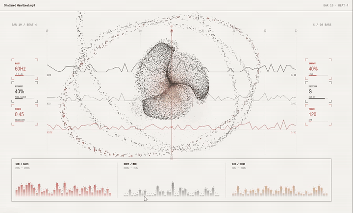
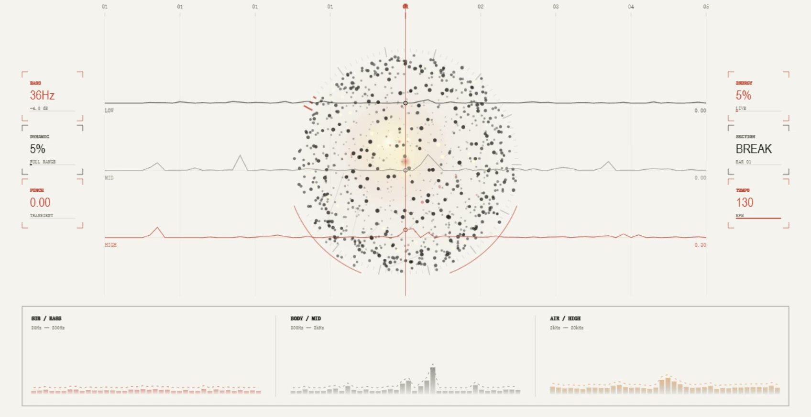
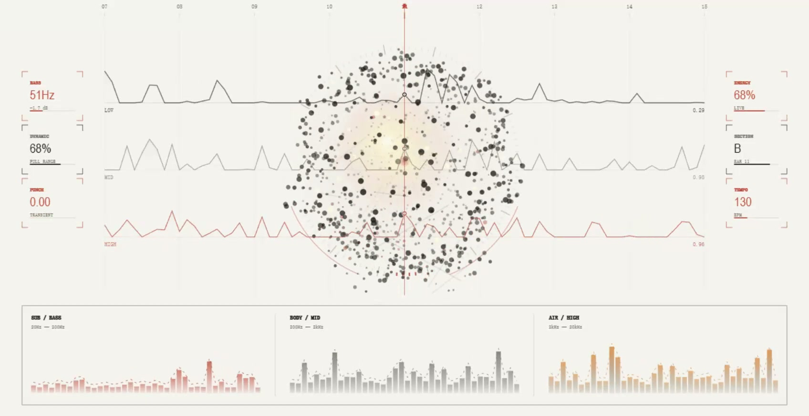
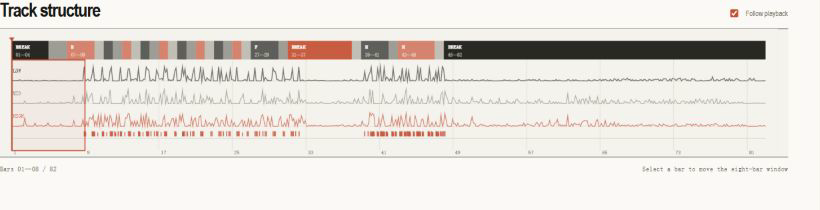
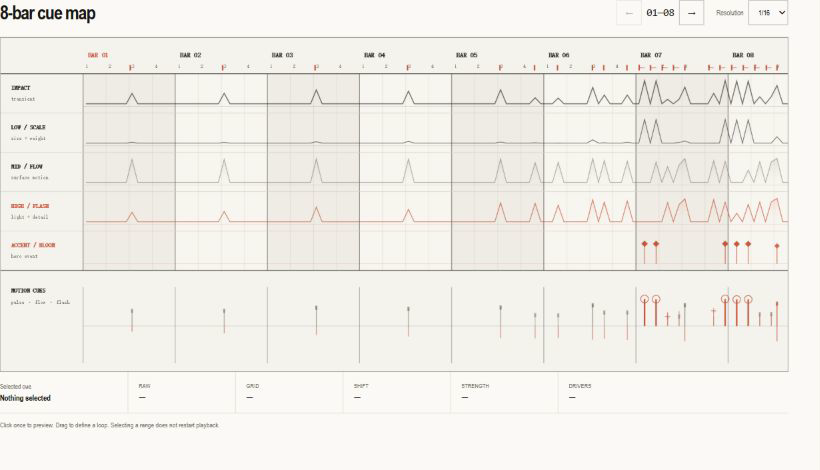
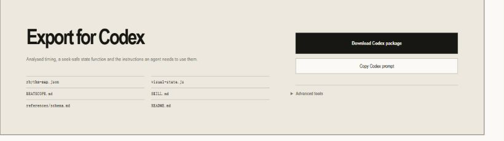
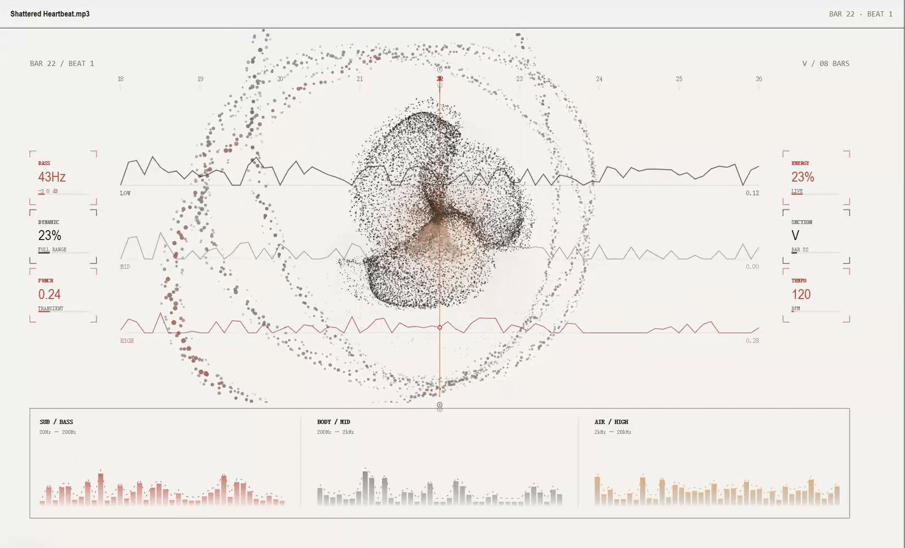
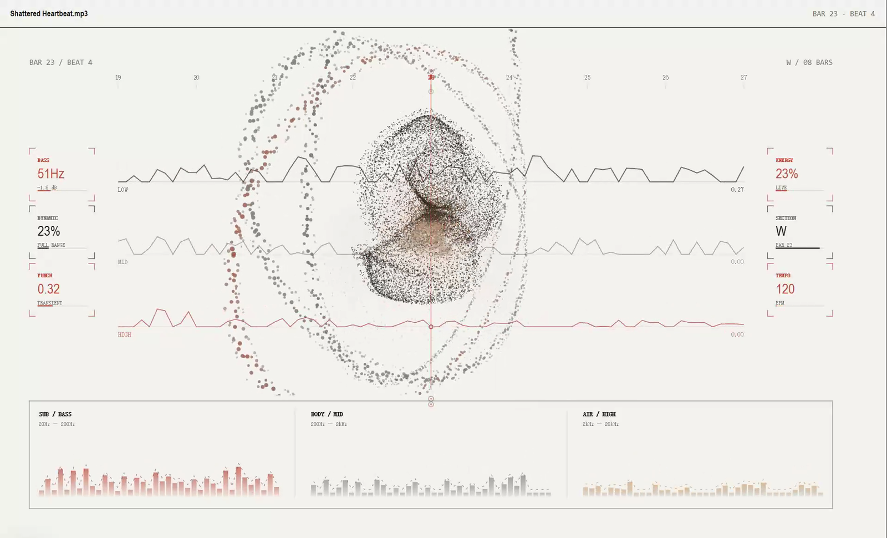

# BeatScope

English | [简体中文](README.zh-CN.md)

A local personal project that turns a song's rhythm into a playable visual reference and a reusable timing package for coding agents.

BeatScope lets you upload a track, play it in the browser, and watch a flowing particle instrument, delayed orbit belts, frequency traces, and a whole-song structure view respond to LOW, MID, HIGH, transients, and section changes. The same analysis is arranged into an eight-bar cue map and exported as a Codex package with its own <code>SKILL.md</code>, so the next visual project does not have to guess the timing of the same song again.

**Click the animation to play the 10-second demo with sound.**

> BeatScope reports rhythm strength, frequency distribution, and timing structure. It does not present uncertain transients as kicks, snares, or 808s. Audio is analysed locally and request-scoped temporary files are removed after processing.

## Why I built it

The difficult part of music visualisation is usually not drawing a shape that moves. It is deciding why it should move at this exact moment, how far it should move, and how the same animation should behave when two songs have completely different rhythmic density.

A direct peak-to-explosion mapping works for sparse music and quickly falls apart on a dense track. Looking only at total volume loses low-frequency weight, high-frequency detail, and section changes. Handing the same song to another agent later also means repeating those decisions from the beginning.

BeatScope keeps that work. Python reads the audio, tracks beats and tempo changes, and extracts multiband energy. The browser uses <code>audio.currentTime</code> as its only clock. The particle system separates ordinary pulse, sustained turbulence, local impact, and rare hero events. The result can be watched directly or reused as timing evidence in the next creative build.

## What one session looks like

~~~text
Upload local audio → build beats and multiband energy
                   → move into the Signal player
                   → play, seek, and inspect whole-song structure
                   → audition or loop an eight-bar cue range
                   → export a Codex package for the next visual project
~~~

1. Choose a WAV, FLAC, MP3, OGG, or M4A file.
2. The local service tracks beats and tempo changes, then derives transients, LOW / MID / HIGH energy, and a structural overview.
3. The page moves into the player, where the particle sphere, traces, and spectrum follow playback.
4. The rhythm pattern overview provides a whole-song view and direct navigation.
5. The eight-bar cue map translates the current window into impact, scale, flow, flash, and bloom references.
6. The Codex export preserves the analysis, a deterministic visual-state function, instructions, and a portable Skill.

More player states

### Quiet passage

### Dense passage

## More than a sphere that moves

### Rhythm pattern overview: see the whole song first

This navigator compresses the complete track into sections, LOW / MID / HIGH energy traces, and transient density. The sections are rhythm-similarity groups, not Verse/Chorus recognition. Clicking a bar seeks directly to it. The red frame always marks the eight bars currently shown in the cue map, so changes do not have to be found by scrubbing blindly through one long timeline.

### Eight-bar cue map: turn listening into usable timing

The same eight-bar window exposes IMPACT, LOW / SCALE, MID / FLOW, HIGH / FLASH, and ACCENT / BLOOM. This is not a drum transcription; it is a motion-oriented reference. A transient can be auditioned with one click, a loop can be dragged out, and the resulting timing, strength, and band drivers can be passed into the next visual build.

### Export for Codex: carry the analysis forward

The package contains more than analysis JSON. It also carries a seek-safe <code>visual-state.js</code>, usage notes, the schema, and a project-level <code>SKILL.md</code>. Drop the ZIP into a new Codex project and the agent can reuse the same timing and visual semantics instead of listening and guessing again.

### The particle instrument

The player's central body is an organic three-lobed particle field drawn beneath the instrument chrome. Tension gathers the cloud before a locally distinct hit; the body then moves as one coherent form around a local hot core while stable edge particles extend into flow-guided streamers. Three surrounding orbit belts receive the same beat later in sequence, so an impact travels outwards instead of making every layer jump at once.

Every phase comes from the tempo-aware motion director and the playback clock alone: the same instant of a song always produces the same frame. Particle seeds may change a streamer's reach or grain size, but never its timing. Fixed-time captures of the other states — rest, recoil, dense passage, a variable-tempo boundary, and reduced motion — live in <code>docs/screenshots/</code>.

## How music changes the scene

The player does not treat every strong beat as the same event. It compares transient strength and local density inside the current song, then spends a limited visual budget.

| Musical state | Visual response |
| --- | --- |
| Ordinary beat | Coherent body breath, a short local core response, then a restrained belt ripple |
| Continuous strong rhythm | Macro flow and surface travel increase without repeated explosions |
| Locally distinct transient | The three lobes separate briefly and edge streamers carry motion outwards |
| Rare hit or section change | Full body expansion and a delayed three-belt propagation when the cooldown allows it |
| LOW / MID / HIGH | Weight and scale, surface flow, detail and brightness |
| Playback position | One clock for particles, traces, structure, and cue map |

The scene is rendered by a deterministic WebGL2 instrument in one draw call: up to 18,000 body points plus three seeded orbit belts of roughly 690 grains each. Anticipation, impact, recoil, aftershock, the continuous macro flow field, lobe-local halo, streamers, and delayed belt ripples are all computed from playback time — never from wall-clock physics. The belts receive one event at three bounded delays instead of mirroring the body on the same frame. The renderer tracks measured cost in rolling 180-frame windows and moves between three body-quality tiers (18,000 / 11,000 / 6,000 points with device-pixel-ratio caps) only after sustained over- or under-load, with a cooldown between changes. When WebGL2 is unavailable or the context is lost, a Canvas 2D fallback with a fixed 680-point body budget keeps the scene alive, and <code>prefers-reduced-motion</code> switches to the restrained variant live. The structure navigator and cue overlay update less often than the main instrument so they do not compete with recording performance; the audio clock itself is never downsampled.

## How the eight-bar reference works

BeatScope aligns raw transients to a 1/16 or 1/32 grid while keeping the real timestamp, quantised position, and offset. It exposes timing facts rather than asking the user to trust an instrument label:

| Cue | Suggested visual direction |
| --- | --- |
| IMPACT | A short geometry, camera, or composition impulse |
| LOW / SCALE | Size, weight, and depth |
| MID / FLOW | Surface and directional movement |
| HIGH / FLASH | Edge light, fine particles, and brief exposure |
| ACCENT / BLOOM | Rare hero events and global emphasis |

Click a cue to audition its nearby transient. Drag to define a loop range. Selection and dragging do not restart the song.

## Rhythm IR: facts, semantics, and presentation

v0.6 tracks beats and tempo on the real timeline: beats come from novelty-guided tracking (local tempo candidates, a global tempo path, per-beat reconstruction, and piecewise-constant tempo segments), not from a uniform global-BPM grid. All rhythm data is arranged into three layers, each depending only on the one above it:

1. **Facts**: what the audio directly supports — beat times, transients (with band energy and strength), and multiband energy frames. No guessing happens here.
2. **Semantics**: derived from facts — global BPM and tempo segments, the bar grid, quantised positions, the section overview, and accent cues. Every field can be traced to its source (<code>analysis.provenance</code>) and its computation (<code>analysis.diagnostics</code>).
3. **Presentation**: maps semantics onto a visual budget — the pulse, turbulence, burst, and hero tiers are allocated by <code>runtime/visual-profile.js</code>, and the player is just one of its consumers.

Project data is written as schema v4 (<code>schema_version: "4.0"</code>) and validated; v3 projects are migrated on load. Core output contains no kick, snare, hihat, or 808 identity, and strength is never renamed into confidence — the page shows the backend, pipeline version, and interpretable diagnostics (provenance methods, migration notes, pregrid merge counts, warning counts).

The shared JavaScript runtime <code>beatscope/runtime/runtime.js</code> is dependency-free ESM with no DOM, Audio, Canvas, or wall-clock access; <code>track.at(time)</code> always returns the same result for the same input, and bar/beat phase in variable-tempo material is derived from adjacent real beats and downbeat spans instead of assuming a global BPM. Meter phase itself remains heuristic continuous numbering from the first tracked beat (provenance marks it as inferred), not a dedicated downbeat model. The web player, the page diagnostics, and the Codex export are all built on it.

## Measured accuracy

The numbers below are generated by the benchmark harness (<code>beatscope benchmark</code>: synthetic audio with ground truth, 70 ms beat and 50 ms onset tolerance) and match <code>build/benchmark-v06/benchmark-results.md</code>; the command exits non-zero when a hard gate fails:

| Case | BPM error | Beat MAE | Beat F1 | Tempo MAE | Segments | Onset F1 |
| --- | ---: | ---: | ---: | ---: | ---: | ---: |
| fixed-120 | 0.18 BPM | 5.78 ms | 1.00 | 0.18 BPM | 1 | 1.00 |
| fixed-90 | 0.16 BPM | 5.65 ms | 1.00 | 0.12 BPM | 1 | 1.00 |
| dense-128 | 0.16 BPM | 5.07 ms | 1.00 | 0.40 BPM | 1 | 1.00 |
| sparse-100 | 0.20 BPM | 9.83 ms | 1.00 | 0.35 BPM | 1 | 1.00 |
| tempo-change | — | 5.79 ms | 1.00 | 0.25 BPM | 2 | 1.00 |
| offgrid | 0.75 BPM | 29.41 ms | 1.00 | 0.73 BPM | 1 | 1.00 |
| bass-heavy | 0.27 BPM | 3.13 ms | 0.97 | 0.18 BPM | 1 | 0.28 |
| silence | — | — | — | — | 1 | — |
| gradual-drift | — | 5.85 ms | 1.00 | 1.74 BPM | 6 | 1.00 |
| micro-drift | — | 5.69 ms | 1.00 | 1.28 BPM | 1 | 1.00 |
| octave-trap | 0.18 BPM | 6.14 ms | 1.00 | 0.18 BPM | 1 | 1.00 |

Hard gates (commit-blocking): a valid schema, fixed-BPM error ≤ 5 BPM, beat F1 ≥ 0.5, at most 20 false events on silence, plus baseline regression windows for the fixed-tempo cases (beat F1 may not drop more than 0.03 and beat MAE may not worsen more than 15 ms) and declared floors for the variable cases — tempo-change must reach beat F1 ≥ 0.55 with per-segment BPM error ≤ 5 BPM, change-point error ≤ 1 s, and at most one missing or extra beat at the seam; gradual-drift needs beat F1 ≥ 0.65 and tempo MAE ≤ 6 BPM; micro-drift allows no octave errors and at most 3 segments; octave-trap allows no octave errors. All 11 cases currently pass (0 gates failed). The v0.5 → v0.6 change is concentrated where it should be: tempo-change beat F1 went from 0.16 to 1.00 (two segments, segment BPM errors 0.185 / 0.325 BPM, change-point error 0.01 s, seam missing 0 / extra 0) while every fixed-tempo case held its ground. Bass-heavy onset F1 is report-only by design: high-frequency onset recall in a bass-dominated synthetic mix is limited by the fixture itself.

## The Codex package

~~~text
beatscope-codex.zip
├── SKILL.md
├── references/schema.md
├── rhythm-map.json
├── visual-state.js
├── beatscope-runtime.js
├── BEATSCOPE.md
└── README.md
~~~

<code>visual-state.js</code> does one thing: <code>getVisualState(time)</code> is the shared runtime's <code>track.at(time)</code>. The browser player and the export package use the same <code>beatscope-runtime.js</code>, so the state an agent consumes is produced by the same implementation the player shows. An agent can read beat phase, band energy, transient impulses, and sections without analysing the audio again, and the scene recovers from pause, seek, or replay using the same playback time.

MIDI, CSV, PNG, and raw JSON remain under **Advanced tools**. MIDI is a quantised timing reference, not a reconstructed drum performance.

## Current implementation

- Local audio loading, format checks, and a safe FFmpeg fallback
- One analysis pipeline: beat grid, transients, multiband energy, and whole-song structure
- Schema v4 validation, v3 project migration, and provenance/diagnostics metadata
- A shared JavaScript runtime: web and export query time through one implementation
- A deterministic WebGL2 particle instrument with coherent lobe motion, flow-guided streamers, delayed orbit belts, adaptive quality tiers, and a Canvas 2D fallback
- Canvas 2D frequency traces, light field, and spectrum deck
- Motion tiers derived from within-song distribution and rhythmic density
- Playback, volume, seek, and eight-bar looping
- Whole-song structure navigation and 1/16 or 1/32 cue maps
- The page shows the analysis backend and interpretable diagnostics, never a fake confidence
- A benchmark with accuracy gates that generates the accuracy report
- Codex ZIP, Skill, JSON, CSV, PNG, and reference MIDI exports
- Request-scoped temporary files, a 250 MB upload cap, and local project cache
- Python, plain JavaScript, and GitHub Actions regression checks

## Stack

| Part | Technology |
| --- | --- |
| Analysis | Python, NumPy, SoundFile |
| Optional high-quality path | librosa, Demucs, Beat This |
| Local service | Python HTTP server |
| Playback | HTML Audio, audio.currentTime |
| Visuals | WebGL2 particles, Canvas 2D, vanilla JavaScript, CSS |
| Exports | JSON, CSV, PNG, Standard MIDI, ZIP Skill package |
| Verification | pytest, Node Test Runner, GitHub Actions |

## Repository structure

~~~text
beatscope/
├── analysis.py             # baseline audio analysis
├── rhythm.py               # fact-based rhythm project
├── beatgrid.py             # beat, quantisation, and offset logic
├── structure.py            # whole-song section overview
├── pipeline.py             # one analysis pipeline, assembles schema v4 projects
├── schema.py               # v4 validator and v3 migration
├── benchmark.py            # synthetic ground-truth benchmark with accuracy gates
├── exports.py              # Codex, CSV, PNG, and MIDI exports
├── server.py               # local upload, project, and media service
├── mcp/                    # MCP server (service, PathPolicy, runtime bridge)
│   └── runtime_worker.mjs  #   Node worker: shared-runtime time queries
├── runtime/                # shared JavaScript runtime (web and export share it)
│   ├── runtime.js          #   track.at / quantize and other time queries
│   └── visual-profile.js   #   pulse/turbulence/burst/hero visual budget
├── agent_skill/            # portable Skill included in each ZIP
└── web/
    ├── app.js              # page state and interaction
    ├── visual-stage.js     # stage controller: layers, director frames, quality tiers
    ├── particle-geometry.js# deterministic three-lobe body and orbit-belt point sets
    ├── particle-shaders.js # WebGL2 vertex/fragment sources
    ├── particle-field.js   # one-draw-call WebGL2 particle renderer
    ├── renderer.js         # instrument chrome, structure, and cue-map rendering
    ├── audio.js            # single audio clock and transport
    └── index.html
skills/beatscope-visualizer/ # repository Skill
tests/                       # Python and JavaScript regression tests
evaluations/                 # MCP evaluation Q&A and fixed fixture
docs/                        # screenshots, demo video, and docs/mcp.md contract
~~~

## Run locally

Python 3.10 or newer is required.

~~~powershell
python -m venv .venv
.\.venv\Scripts\Activate.ps1
pip install -e ".[dev]"
beatscope serve
~~~

Open <code>http://127.0.0.1:8765</code> and choose an audio file. WAV, FLAC, and OGG use SoundFile. When the installed libsndfile cannot decode MP3, BeatScope falls back to FFmpeg.

Useful commands:

~~~powershell
beatscope serve
beatscope rhythm song.wav --drums drums.wav --beat-this song.beats --output rhythm.json
beatscope separate song.wav --output-dir .beatscope-cache\song\stems --model htdemucs --device cuda
beatscope benchmark
beatscope doctor
~~~

## MCP server: let agents use the rhythm facts directly

BeatScope ships a local MCP server (`beatscope_mcp`). MCP clients such as
Codex or Claude Desktop can analyze a local song, query beats, onsets, and
cues in precise time windows, and export the agent handoff ZIP - without
the web page and without reading the source. Timing semantics (bar/beat
phases, energy interpolation, onset impulse, quantisation) are computed by
the same JavaScript runtime the web player and the export package use, so
all three paths agree by construction.

Install and start:

~~~powershell
pip install -e ".[mcp]"
beatscope-mcp
~~~

The server speaks stdio; analysis happens locally and no audio or other
data is ever sent over the network.

| Tool | Purpose |
| --- | --- |
| `beatscope_list_projects` | List cached projects (BPM, bars, backend, provenance) |
| `beatscope_get_project` | Read a project as summary / timing / full JSON |
| `beatscope_analyze_audio` | Analyze and cache audio; progress and cancellation, multi-config coexistence |
| `beatscope_get_visual_state` | Full visual state at one instant, identical to the web player |
| `beatscope_get_events` | beats / onsets / cues / patterns in a (start, end] window |
| `beatscope_export_package` | Export the portable agent ZIP (atomic write, SKILL and schema included) |

Security model: every input and output path must live inside the
`BEATSCOPE_ALLOWED_ROOTS` allowlist (default: the current directory);
anything else is rejected up front. Export destinations must end in `.zip`.

Codex CLI (`~/.codex/config.toml`):

~~~toml
[mcp_servers.beatscope]
command = "C:\\src\\beatscope\\.venv\\Scripts\\beatscope-mcp.exe"

[mcp_servers.beatscope.env]
BEATSCOPE_ALLOWED_ROOTS = "C:\\Users\\me\\Music;D:\\work\\videos"
~~~

Claude Desktop (`claude_desktop_config.json`):

~~~json
{
  "mcpServers": {
    "beatscope": {
      "command": "C:\\src\\beatscope\\.venv\\Scripts\\beatscope-mcp.exe",
      "env": { "BEATSCOPE_ALLOWED_ROOTS": "C:\\Users\\me\\Music" }
    }
  }
}
~~~

Semantics statement: the MCP surface exposes transient and band facts only;
it does not identify kick, snare, hi hat, or 808. The server's instructions
repeat this to the agent.

Troubleshooting: "runtime bridge unavailable" → install Node.js 20+ or set
`BEATSCOPE_MCP_NODE` to the node binary; "outside BeatScope's allowed
roots" → add the file's directory to `BEATSCOPE_ALLOWED_ROOTS` and restart;
"does not exist" → check `beatscope_list_projects` first or create the
project with `beatscope_analyze_audio`. The full contract lives in
[docs/mcp.md](docs/mcp.md).

## Optional high-quality path

The built-in analyser is enough to try the player. For a dense mix, install the optional dependencies and provide Beat This timing with a Demucs drums stem:

~~~powershell
pip install -e ".[high-quality]"
beatscope separate "song.wav" --output-dir .beatscope-cache\song\stems --model htdemucs --device cpu
beatscope rhythm "song.wav" --drums drums.wav --beat-this song.beats --output rhythm.json
beatscope serve --project rhythm.json
~~~

When <code>--device cuda</code> is selected, BeatScope does not silently fall back to CPU.

## Verification

~~~powershell
pytest -q
python -m pytest tests\mcp -q
node --test tests\test_grid.js tests\test_interaction.js tests\test_runtime.js tests\test_visual_profile.js tests\test_playback_characterization.js tests\test_visual_stage.js tests\test_particle_geometry.js tests\test_particle_uniforms.js
beatscope benchmark
~~~

On the JavaScript side the grid and interaction tests cover page behaviour; the runtime and visual profile tests cover the shared runtime contract and purity constraints; the characterisation test compares the web player and the Codex export paths at the same instants; the visual-stage, particle-geometry, and particle-uniform tests pin the deterministic director frames, point-set determinism, and uniform conversion, including the adaptive quality tiers and the forced-fallback paths. The Python suite additionally asserts that the built wheel ships the particle modules. The MCP tests cover the tool contract, path safety, runtime parity, and export. GitHub Actions runs the core checks on Windows and Ubuntu with Python 3.10 and 3.12.

## Known limits

- The built-in analysis does not reliably identify kick, snare, or 808 identity. It reports transient and frequency evidence.
- The WebGL2 particle instrument renders up to 18,000 body points plus three orbit belts; where WebGL2 is unavailable the Canvas 2D fallback keeps a deliberately small fixed body budget (at most 680 points), so very high-resolution recording still favours a WebGL2-capable browser.
- Automatic section labels describe energy and repetition, not human arrangement notation.
- MP3 support depends on local libsndfile or FFmpeg.
- BeatScope is a local creative reference, not a DAW, FLP generator, or exact drum transcription tool.

## Project status

BeatScope now covers the complete local path from audio upload and playable visualisation to whole-song structure, an eight-bar cue map, and a Codex Skill export. v0.6.0 added real-timeline variable-tempo tracking and preserved tempo segments through runtime, MIDI, MCP, and Codex export. v0.6.1 rebuilt the player around a deterministic WebGL2 particle instrument with coherent body motion, flow-guided streamers, delayed orbit belts, adaptive budgets, and a safe fallback. The package is v0.6.1 while the analysis pipeline deliberately remains versioned 0.6.0. BeatScope is still a personal experiment in progress; the next priority is keeping this visual language stable across more songs, devices, and recording conditions.

## License

This project is available under the [MIT License](LICENSE).
