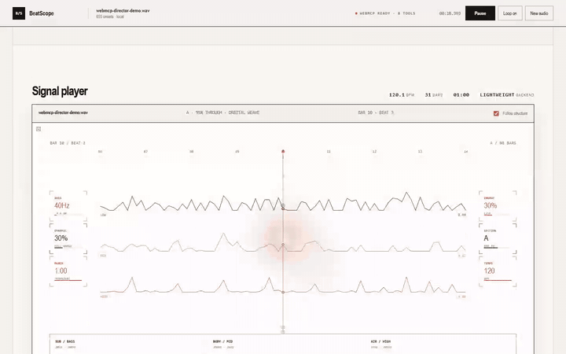

# BeatScope

English | [简体中文](README.zh-CN.md)

[](https://github.com/chosuicide/beatscope/actions/workflows/ci.yml)
[](https://github.com/chosuicide/beatscope/releases)
[](LICENSE)

**Give a coding agent measured music timing — exact beats, raw events, structure, and a caller-sized set of moments worth responding to.**

[](docs/demo/beatscope-demo.mp4)

BeatScope brings three parts together:

- **Studio** — upload audio, inspect beats and structure, loop an eight-bar window, and watch a seek-safe visual instrument.
- **Timing package** — export the song as a portable, self-checking `.beatscope` handoff with no source audio inside.
- **Runtime + MCP** — let a visual project or coding agent query the same frame, or spend a fixed response budget, without re-analysing the music.

It reports timing, transient strength, frequency distribution, and neutral structural repetition. It does **not** pretend uncertain events are kicks, snares, or 808s.

## Spend a budget, not every onset

Dense music can contain many valid transients. Making an animation or edit react to all of them produces jitter, even when every timestamp is correct. BeatScope v0.11 keeps the raw event layer intact and adds an optional `response_relevance` ordering trained from licensed human-authored chart consensus.

The consumer still owns the decision. It asks for a count, not a magic threshold:

```js
const selection = track.responseBetween(startTime, endTime, 12);
// selection.events: 12 existing onsets, restored to chronological order
// response_relevance: ordering only — not probability or confidence
```

No onset is created, deleted, quantised, or moved. Without the sidecar, the same call returns an explicit chronological fallback instead of pretending a model was used.

## Try it in three minutes

Python 3.10+ is required.

```powershell
git clone https://github.com/chosuicide/beatscope.git
cd beatscope
python -m venv .venv
.\.venv\Scripts\Activate.ps1
pip install -e ".[dev]"
beatscope serve
```

Open `http://127.0.0.1:8765`, choose a WAV, FLAC, MP3, OGG, or M4A file, and press play. Analysis is local; request-scoped temporary files are removed after processing.

## Compose an artwork (local preview)

Open `/app/?composition=1` on your local server. The new workspace puts one artwork in the centre: add text or media, drag and resize objects, then choose which ones respond to the music. **Stay still** is a valid choice.

The three background materials use Butterchurn's original presets and audio response, with author credits. Foreground objects use BeatScope's measured event times and optional v0.11 ranking. These are separate systems; background feedback is not guaranteed to reproduce the same pixels after seeking.

**Export for Agent** saves the artwork, its media, shared foreground runtime, original timing package, preview page and checksums. Unzip it, run `node probe.mjs`, then `python -m http.server 8080`. Relink the original audio in the preview; its SHA-256 must match. Audio is excluded from the archive.

This is a local preview, not a new published release. The existing workspace and WebMCP Director remain available at their original entry points. The new editor currently has an English interface, two foreground response operators, and no video-file export. Cross-Agent validation of the new composition package is still pending.

## Work with BeatScope from the browser

BeatScope Director exposes the loaded track as eight WebMCP tools. An Agent can
inspect any moment, read bounded events, find and compare visual ranges, then
focus, audition, and loop a range in the same player the user is watching.

**[Open the live Director demo](https://chosuicide.github.io/beatscope/?demo=webmcp)** — no install required. It is a static, pre-analyzed demo; run Studio locally to analyze your own audio.

[](docs/demo/webmcp-director.mp4)

Or run the Director demo locally. It ships a pre-analyzed track that this
repository synthesized for exactly this purpose — never a commercial recording.

```powershell
python scripts/build_webmcp_demo.py
python tests/browser/webmcp_demo_server.py --port 8770 --directory build/webmcp-demo
```

Open `http://127.0.0.1:8770/?demo=webmcp` in a WebMCP-capable browser; the header shows `WEBMCP READY · 8 TOOLS`.

Before letting an Agent drive, the ground rules:

- **Two entries, one model.** WebMCP is the in-browser collaboration entry; the local stdio [MCP server](docs/mcp.md) stays the developer entry. Both read the same Rhythm IR through the same deterministic runtime — only transport and lifecycle differ.
- **No audio leaves the page.** Tools answer from the loaded analysis, so the Agent queries timing facts, not sound. The Studio's local upload-and-analyze flow is unchanged.
- **Neutral labels, suggestions only.** Structure appears as repeat families (`A`, `B`, `A′`) — never "verse" or "chorus" — and a candidate range is a measured suggestion to audition, not musical truth.
- **Visible and reversible.** Page-changing Agent actions appear in the on-page ledger; read-only inspection stays read-only. The latest action can be undone from the UI.

Tool names, schemas, limits, error codes, and example prompts: [docs/webmcp.md](docs/webmcp.md).

## One package, different visual languages

The three reference works below consume the same frozen handoff. They share timing facts — not components, renderers, or visual metaphors.

[](docs/demo/consumer-showcase.mp4)

| Canvas 2D | Three.js | Remotion |
| --- | --- | --- |
|  |  |  |
| Zero-build interactive study | Pinned `three@0.169.0` sculpture | Deterministic offline composition |
| [Open example](examples/canvas-particles) | [Open example](examples/threejs-geometry) | [Open example](examples/remotion-composition) |

All three read one function:

```js
import { getVisualState } from "./fixture.beatscope/visual-state.js";

function render(time) {
  const facts = getVisualState(time);
  // facts: bar, beat, beatPhase/barPhase, LOW/MID/HIGH, onset, accent, structure
  // The direction — spread, flow, boundary envelopes, palette — is authored by
  // each consumer, because the package ships measurements and no scene.
}
```

Use `audio.currentTime` in an interactive player or `frame / fps` in an offline renderer. Pause, seek, replay, and repeated renders resolve the same instant to the same state.

## A fresh-context Codex result

This fourth work was not designed inside the BeatScope repository. A fresh Codex task received only the frozen brief, checkpoints, and exported handoff, then built **Orbital Notation**, a dependency-free Canvas consumer.


The capture above was taken while its synthetic fixture audio was actually playing. The run passed all 5 required validation layers, including browser play, seek, replay, deterministic state, and reduced-motion timing. Generated source required no human repair; the operator only supplied the pinned browser-test path. [Read the run record](evaluations/agent-interoperability/runs/codex-canvas-2026-09-02.json) or [see the generated conformance table](evaluations/agent-interoperability/conformance.md).

**Evidence status:** 1 fresh-context Coding Agent product recorded. The broader “validated across Coding Agents” claim remains pending until a second independent product passes the same frozen task.

## What happens after upload

```text
local audio
   │
   ├─ beat times + tempo changes
   ├─ transients + LOW / MID / HIGH energy
   ├─ optional response relevance over those same transients
   └─ neutral structure: A / B / A′ + boundaries
                │
                ├─ Studio player and eight-bar cue map
                ├─ optional response ordering for a bounded animation budget
                ├─ MCP queries
                └─ self-describing handoff package
```

### Studio


The whole-song navigator shows energy, transient density, and repeated structural families. Letters mean recurrence, never guessed roles: `A′` is related to `A`, not “Chorus” or “Verse”. Click a bar to seek; use `Shift+←/→` to jump between boundaries.


The current eight bars expose `IMPACT`, `LOW / SCALE`, `MID / FLOW`, `HIGH / FLASH`, and `ACCENT / BLOOM`. Click a cue to audition it or drag a loop without restarting playback.

### Handoff package

Every export carries measured timing facts, a deterministic runtime, Agent routing instructions, a Skill, integrity hashes, and a dependency-free probe — and deliberately **no visual layer**: no recipe, no scene timeline, no style, no task statement, because the visual is the consumer's decision and a package that pre-decides it stops the agent from asking the user what they want.

```text
project.beatscope/
├── beatscope-package.json     routing manifest: entry, probe, capabilities, summary, per-member sha256
├── README.md                  the inventory, what is deliberately absent, what is authoritative
├── AGENT.md                   the contract: clock, purity, ground rules, what to settle with the user
├── rhythm-map.json            the measured facts (authoritative)
├── rhythm.mid / rhythm.csv    the same facts for a DAW or a spreadsheet
├── response-relevance.json    ordering-only sidecar for spending a response budget (+ -data.js copy)
├── visual-state.js            getVisualState(time), getResponseEvents(start, end, budget)
├── beatscope-runtime.js       the shared runtime the accessor builds on
├── worker-example.js          module Worker adapter
├── consumer-probe.js          self-check: node consumer-probe.js .
├── BEATSCOPE.md               timing invariants
├── SKILL.md, references/schema.md
└── LICENSE
```

Source audio is never bundled. `response-relevance.json` contains onset ids and bounded ordering values, never replacement timestamps. A consumer can verify paths, manifest shape, hashes, executable templates, checkpoints, and clock semantics before it runs package JavaScript.

```powershell
beatscope validate-handoff path\to\project.beatscope --checkpoints checkpoints.json
beatscope validate-consumer examples\canvas-particles --browser
beatscope validate-consumer examples\remotion-composition --offline
```

## MCP: query music without opening the Studio

```powershell
pip install -e ".[mcp]"
beatscope-mcp
```

The local stdio server exposes six tools:

| Tool | Use it for |
| --- | --- |
| `beatscope_list_projects` | Find locally cached analyses |
| `beatscope_get_project` | Read timing, provenance, and structure summaries |
| `beatscope_analyze_audio` | Analyse local audio with progress and cancellation |
| `beatscope_get_visual_state` | Resolve the exact visual state at one time |
| `beatscope_get_events` | Query facts in a window; optionally spend `response_budget` on ranked, unshifted onsets |
| `beatscope_export_package` | Write a portable handoff atomically |

Paths are restricted by `BEATSCOPE_ALLOWED_ROOTS`; analysis and queries stay local. See the complete [MCP contract and client configuration](docs/mcp.md).

## Why it stays in sync

BeatScope separates three layers:

1. **Facts** — beat timestamps, transients, and multiband energy.
2. **Semantics** — tempo segments, bars, quantised cues, boundaries, and repeat families.
3. **Presentation** — motion budgets, structural scenes, and transition envelopes.

The dependency-free JavaScript runtime has no DOM, Audio, Canvas, or wall-clock dependency. The player, MCP bridge, exported package, and reference consumers query that same model instead of carrying slightly different copies of the song.

The built-in WebGL2 instrument is one demonstration, not the product boundary. It renders a three-lobed field, flow-guided streamers, and delayed orbit belts from playback time in one draw call, with adaptive quality, a Canvas fallback, and live reduced-motion support.

<details>
<summary><strong>Accuracy, determinism, and benchmark gates</strong></summary>

The audio benchmark contains 11 synthetic cases with frozen ground truth: fixed, dense, sparse, off-grid, bass-heavy, silence, abrupt tempo change, gradual drift, micro-drift, and an octave trap. All current gates pass. The tempo-change case improved from beat F1 `0.16` to `1.00`; its two tempo segments land within `0.185 / 0.325 BPM`, with a `0.01 s` change-point error and no missing or extra seam beat.

These deterministic synthetic fixtures are regression evidence with exact ground truth, not a blanket claim of real-world music-information-retrieval accuracy.

The v0.11 response ranker has a separate sealed holdout: 23 songs and 144 licensed StepMania charts from a source excluded from development. Against raw onset strength, it improves pairwise agreement by `0.0238`, NDCG@10 by `0.2983`, and recall-at-budget by `0.0847`; the 95% bootstrap interval for pairwise gain is `[0.0146, 0.0336]`. This measures agreement with gameplay-oriented human chart consensus, not universal musical importance.

Structure has a separate ten-arrangement benchmark. Visual orchestration has 28 blocking gates covering seek/order determinism, family identity, boundary continuity, reduced-motion scaling, draw-call count, and runtime budgets. CI runs on Windows and Ubuntu with Python 3.10 and 3.12, plus pinned browser-consumer and Remotion offline evidence jobs.

```powershell
beatscope benchmark
beatscope benchmark-structure
beatscope benchmark-visual
```

</details>

## Useful commands

```powershell
beatscope serve
beatscope rhythm song.wav --output rhythm.json
beatscope visual-build rhythm.json
beatscope doctor
beatscope benchmark
```

For dense mixes, optional Beat This and Demucs inputs are available through `.[high-quality]`; selecting CUDA never silently falls back to CPU.

## Documentation

- [WebMCP Director tools](docs/webmcp.md)
- [MCP server and client setup](docs/mcp.md)
- [Consumer conformance](evaluations/agent-interoperability/conformance.md)
- [Frozen cross-Agent task](evaluations/agent-interoperability/TASK.md)
- [Repository Skill](skills/beatscope-visualizer/SKILL.md)
- [Releases](https://github.com/chosuicide/beatscope/releases)

## Development

```powershell
pytest -q
npm run test:js
beatscope validate-handoff examples\shared\fixture.beatscope --checkpoints examples\shared\checkpoints.json
```

The repository includes Python, JavaScript, browser, package-integrity, MCP, benchmark, and cross-platform regression coverage. Generated evidence is replayed in CI; CI never contacts remote Agents.

## Limits

- BeatScope supplies deterministic musical timing, not finished art direction.
- Structural families describe repetition, not emotion, lyrics, or Verse/Chorus roles.
- The built-in analyser reports transient and band evidence, not instrument identity.
- `response_relevance` is a budget-ordering value learned from chart consensus, not probability, confidence, or musical truth.
- Source audio is not included in exports or examples.
- MP3 support requires local libsndfile support or FFmpeg.
- Very long, gradual, or ambiguous arrangements may honestly resolve to one structural segment.
- Beat/tempo/structure accuracy still relies primarily on deterministic synthetic fixtures. The response ranker has one licensed StepMania holdout source; broader genres, formats, and public MIR datasets remain future work.

## License

[MIT](LICENSE)
