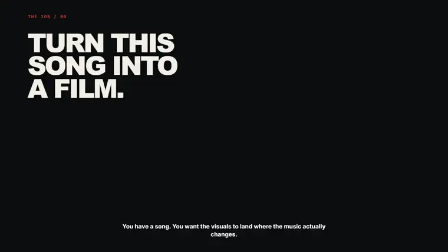
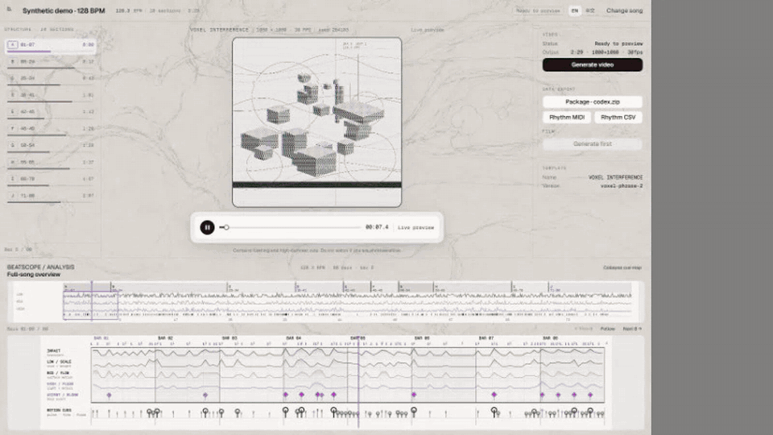
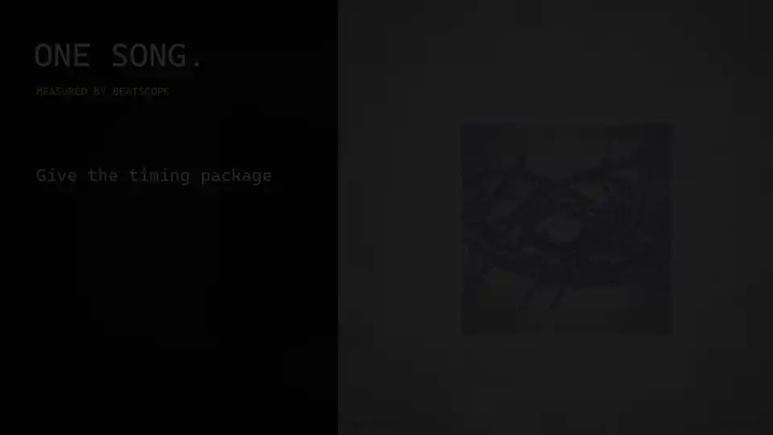
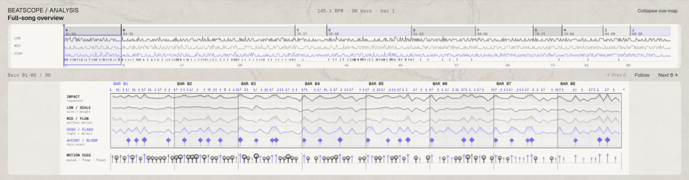

# BeatScope

English | [简体中文](README.zh-CN.md)

[](https://github.com/chosuicide/beatscope/actions/workflows/ci.yml)
[](https://github.com/chosuicide/beatscope/releases/tag/v0.12.2)
[](LICENSE)

**Turn a song into a beat-synchronised film — or give its timing to a coding agent.**

BeatScope listens for beats, real transients, energy changes, tempo changes and repeated sections. Beathi Studio turns those measurements into a movie preview and a reusable timing package. Everything runs locally; your audio is not uploaded.

[](https://github.com/chosuicide/beatscope/releases/download/v0.12.0/beatscope-v0.12.0-product-tour.mp4)

**[▶ Watch the 57-second product tour](https://github.com/chosuicide/beatscope/releases/download/v0.12.0/beatscope-v0.12.0-product-tour.mp4)**

## What you do

1. Upload a WAV, FLAC, MP3, OGG or M4A file.
2. Check the film preview, song structure and rhythm map.
3. Render a video, export MIDI/CSV, or give the `.beatscope` package to a coding agent.



## Download and run

### Windows

Download **[Beathi Studio v0.12.2](https://github.com/chosuicide/beatscope/releases/download/v0.12.2/Beathi-Studio-v0.12.2-windows-x64.zip)**, extract it, then double-click **Beathi Studio.exe**. The portable package already includes the analyser, browser and FFmpeg.

### Python 3.10+

Download the wheel from the [v0.12.2 release](https://github.com/chosuicide/beatscope/releases/tag/v0.12.2), then run:

```powershell
pip install beatscope-0.12.2-py3-none-any.whl
beatscope serve --open
```

## Two useful outputs

### A film you can watch

The built-in template gives you an immediate music-video preview and can render an MP4. The preview, playhead and rhythm maps all follow the same audio clock, so seeking does not restart the analysis.

### Timing a coding agent can use



Export the `.beatscope` package, then give it to an agent together with your footage, images or references. The package contains measured timing—not a fixed visual style—so the agent can build something new without guessing where the music hits.

```text
your song
   ↓
BeatScope measures the timing
   ↓
.beatscope package + your media + your idea
   ↓
coding agent creates the visual
```

## What BeatScope measures



- beats, bars and tempo changes;
- original onset timestamps—the sound is never moved onto a prettier grid;
- LOW / MID / HIGH energy;
- neutral repeated sections such as A / B / A′;
- optional response ordering for dense songs, so consumers do not react to everything.

BeatScope does **not** pretend to know that a sound is a kick, snare or 808. It reports evidence and lets the renderer decide what to do with it.

<details>
<summary><strong>What is inside the Agent package?</strong></summary>

The package includes `rhythm-map.json`, MIDI and CSV views, a deterministic JavaScript runtime, a self-checking probe, member hashes, and short Agent instructions. It does not include the source audio, a visual template or a pre-written creative task.

`response_relevance` only ranks existing onsets. It is not a probability, confidence score or claim about musical truth; no onset is created, deleted or moved.

</details>

## For developers

```powershell
git clone https://github.com/chosuicide/beatscope.git
cd beatscope
python -m venv .venv
.\.venv\Scripts\Activate.ps1
pip install -e ".[dev,mcp]"
beatscope serve --open
```

BeatScope also provides:

- a local stdio MCP server for analysis and bounded timing queries;
- seven browser WebMCP tools inside Beathi Studio;
- deterministic runtime helpers for browser workers and offline renderers;
- reference consumers for Canvas, Three.js and Remotion;
- `beatscope validate-handoff <package.zip>` and `beatscope validate-consumer <package.zip>`,
  which check an exported package against the consumer contract before you build on it.

Read more: [movie renderer](docs/local-movie.md) · [MCP](docs/mcp.md) · [WebMCP](docs/webmcp-studio.md) · [high-precision mode](docs/high-precision.md) · [Agent Skill](skills/beatscope-visualizer/SKILL.md)

## Honest limits

- The current Studio ships one built-in film template.
- Structure labels describe repetition, not Verse/Chorus or emotion.
- Real-world beat, tempo and structure evaluation still needs broader public benchmarks.
- MP3 support requires local libsndfile support or FFmpeg.

## License

[MIT](LICENSE)
