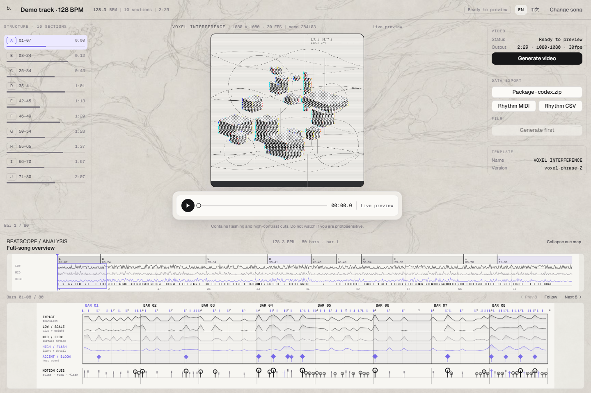
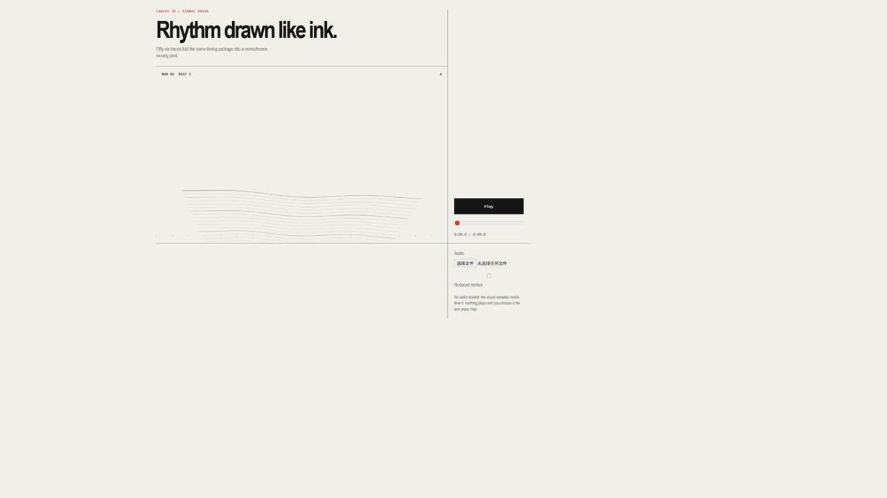
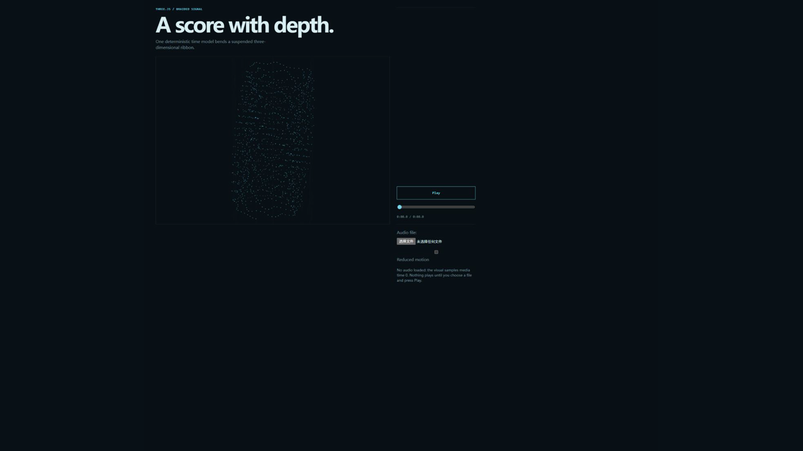
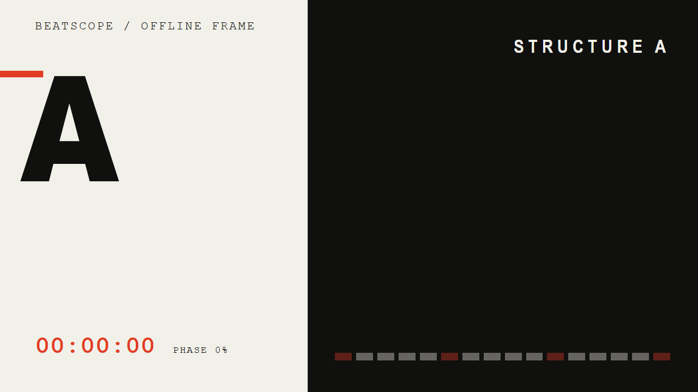

# BeatScope

English | [简体中文](README.zh-CN.md)

[](https://github.com/chosuicide/beatscope/actions/workflows/ci.yml)
[](https://github.com/chosuicide/beatscope/releases)
[](LICENSE)

**Turn one song into a beat-synchronised film and a timing package a coding agent can verify.**

BeatScope measures beats, raw transients, multiband energy, tempo changes and recurring structure. Beathi Studio uses those measurements to preview and render a deterministic music video. The same facts can leave the Studio as a self-checking `.beatscope` package or be queried over MCP.

It does not guess kick, snare or 808 labels, and it never moves a real event onto a cleaner-looking grid.


## The short path

```powershell
git clone https://github.com/chosuicide/beatscope.git
cd beatscope
python -m venv .venv
.\.venv\Scripts\Activate.ps1
pip install -e ".[dev]"
beatscope serve
```

Open `http://127.0.0.1:8765`, choose a WAV, FLAC, MP3, OGG or M4A file, and let the local analyser finish. You can then:

1. play the built-in film preview;
2. inspect the whole-song structure and eight-bar cue map;
3. render an MP4 when the local browser and FFmpeg support it; or
4. export timing data for a DAW or coding agent.

Python 3.10+ is required. Analysis, preview and rendering stay on the machine; request-scoped temporary files are removed after processing.

## What the Studio shows



The Studio is deliberately one screen rather than an editing timeline:

- **Structure** — neutral A / B / A′ recurrence families. They are navigation, not invented Verse/Chorus labels.
- **Live preview** — the current `VOXEL INTERFERENCE` template, driven by measured timestamps and one deterministic seed.
- **Film** — an on-demand 1080×1080, 30 fps render of the same plan used by the preview.
- **Data export** — the timing package, MIDI and CSV. Source audio is not bundled.
- **Analysis dock** — a full-song overview and an eight-bar map for impact, scale, flow, flash/bloom and motion cues.


The media element is the only playback clock. The film preview, playhead, structure list and both maps read that clock; seeking does not restart analysis or invent a second timeline.

In a WebMCP-capable browser, the same Studio also becomes a bounded Director for an Agent. Seven tools can inspect the visible song, explain why the film reacts, control audition playback, start or cancel a render, and prepare the timing-package download. State-changing calls are visible in the interface and audition state can be restored; browsers without WebMCP keep the ordinary Studio experience.

## Why dense songs do not drive every frame

A dense mix can contain many valid onsets. Reacting to all of them produces jitter even when every timestamp is correct. BeatScope keeps every raw event and adds an optional `response_relevance` ordering learned from licensed human-authored chart consensus.

The consumer spends a count, not a magic threshold:

```js
const selection = track.responseBetween(startTime, endTime, 12);
// 12 existing onsets, returned in chronological order.
// response_relevance is ordering only: not probability or confidence.
```

No onset is created, deleted, quantised or moved. If the sidecar is absent, the runtime says it used chronological fallback instead of pretending a model was available.

## The Agent handoff

The exported package carries measurements and their executable timing contract. It deliberately carries no style, scene timeline, template, source audio or pre-written task: the receiving agent should still ask what the user wants to make and what media is available.

```text
project.beatscope/
├── beatscope-package.json     entry points, capabilities and member hashes
├── rhythm-map.json            authoritative measured facts
├── response-relevance.json    ordering over existing onset ids
├── rhythm.mid / rhythm.csv    DAW and tabular views of the same facts
├── visual-state.js            getVisualState() + getResponseEvents()
├── beatscope-runtime.js       deterministic, DOM-free timing runtime
├── consumer-probe.js          dependency-free self-check
├── worker-example.js          module Worker adapter
├── AGENT.md / BEATSCOPE.md    reading order and timing invariants
├── SKILL.md / references/     instructions and schema
└── LICENSE
```

```powershell
beatscope validate-handoff path\to\project.beatscope --checkpoints checkpoints.json
beatscope validate-consumer examples\canvas-particles --browser
beatscope validate-consumer examples\remotion-composition --offline
```

One frozen handoff already drives three independent reference consumers:

| Canvas 2D | Three.js | Remotion |
| --- | --- | --- |
|  |  |  |
| Zero-build browser study | Pinned `three@0.169.0` sculpture | Deterministic offline composition |
| [Open example](examples/canvas-particles) | [Open example](examples/threejs-geometry) | [Open example](examples/remotion-composition) |

A separate fresh-context Codex run received only the frozen task and handoff, then produced the dependency-free Canvas work **Orbital Notation**. It passed browser play, seek, replay, deterministic-state and reduced-motion checks without source repair. [Run record](evaluations/agent-interoperability/runs/codex-canvas-2026-09-02.json) · [conformance table](evaluations/agent-interoperability/conformance.md)

## Work with BeatScope from the browser

In a WebMCP-capable browser the studio registers seven tools, so an Agent can inspect the loaded song, ask for a bounded set of original response timestamps, explain why the movie cuts where it does, audition a passage, start a seeded render, and prepare the timing package — without receiving the source audio or running a second analysis. Buttons and tools call the same functions; every page-changing call appears in a strip above the transport, with Restore after an audition. Ordinary browsers show nothing new. Everything runs on the user's machine, and response relevance is an ordering value, never a probability or a confidence. Contract, budgets and local verification: [docs/webmcp-studio.md](docs/webmcp-studio.md).

## MCP

```powershell
pip install -e ".[mcp]"
beatscope-mcp
```

The local stdio server exposes six stable tools:

| Tool | Purpose |
| --- | --- |
| `beatscope_list_projects` | List cached analyses |
| `beatscope_get_project` | Read timing, provenance and structure summaries |
| `beatscope_analyze_audio` | Analyse local audio with progress and cancellation |
| `beatscope_get_visual_state` | Resolve measured facts at one instant |
| `beatscope_get_events` | Query a bounded window and optionally spend a response budget |
| `beatscope_export_package` | Write a handoff package atomically |

Allowed paths are restricted by `BEATSCOPE_ALLOWED_ROOTS`. See [docs/mcp.md](docs/mcp.md) for the full contract and client configuration.

## Data path

```text
local audio
   └─ measurement
      ├─ exact beats + tempo segments
      ├─ raw onsets + LOW / MID / HIGH energy
      ├─ optional ordering over those same onsets
      └─ neutral structure + boundaries
          ├─ Beathi preview and MP4 render
          ├─ full-song and eight-bar maps
          ├─ MIDI / CSV / .beatscope export
          └─ runtime and MCP queries
```

The analyser produces facts. Consumers choose presentation. That separation is why an interactive player, an offline renderer and a coding agent can resolve the same musical instant without sharing a renderer.

<details>
<summary><strong>Evidence and benchmark boundaries</strong></summary>

The audio regression suite contains 11 synthetic cases with frozen ground truth, including dense, sparse, off-grid, abrupt and gradual tempo changes, silence and an octave trap. The abrupt-change case currently reaches beat F1 `1.00`, with `0.185 / 0.325 BPM` segment errors and a `0.01 s` change-point error. These fixtures prevent regressions; they are not a blanket real-world MIR accuracy claim.

The response ranker has a sealed holdout of 23 songs and 144 licensed StepMania charts from a source excluded from development. Against raw onset strength it improves pairwise agreement by `0.0238`, NDCG@10 by `0.2983` and recall-at-budget by `0.0847`; the pairwise-gain 95% bootstrap interval is `[0.0146, 0.0336]`. This measures agreement with gameplay-oriented chart consensus, not universal musical importance.

Structure has a separate ten-arrangement benchmark. CI runs on Windows and Ubuntu with Python 3.10 and 3.12, and replays pinned browser-consumer and Remotion evidence without contacting remote agents.

</details>

## Commands and documentation

```powershell
beatscope serve
beatscope analyze song.wav
beatscope doctor
beatscope benchmark
beatscope benchmark-structure
```

- [Local Studio and movie renderer](docs/local-movie.md)
- [Studio design and failure contracts](docs/design/movie-studio.md)
- [MCP server](docs/mcp.md)
- [Frozen cross-Agent task](evaluations/agent-interoperability/TASK.md)
- [Repository Skill](skills/beatscope-visualizer/SKILL.md)

Development gates:

```powershell
pytest -q
npm run test:js
npm run check:web-deps
npm run typecheck --prefix web-src
npm run build --prefix web-src
```

## Limits

- BeatScope supplies deterministic timing, not finished art direction.
- Structure families describe recurrence, not emotion, lyrics or song-section names.
- The analyser reports transient and band evidence, not instrument identity.
- `response_relevance` is an ordering value, not probability, confidence or musical truth.
- MP3 support requires local libsndfile support or FFmpeg.
- Long, gradual or ambiguous arrangements may honestly resolve to one segment.
- The built-in Studio currently ships one film template; the timing package is intentionally renderer-independent.
- Beat/tempo/structure accuracy is still guarded mainly by synthetic fixtures. Broader public real-music evaluation remains future work.

## License

[MIT](LICENSE)
