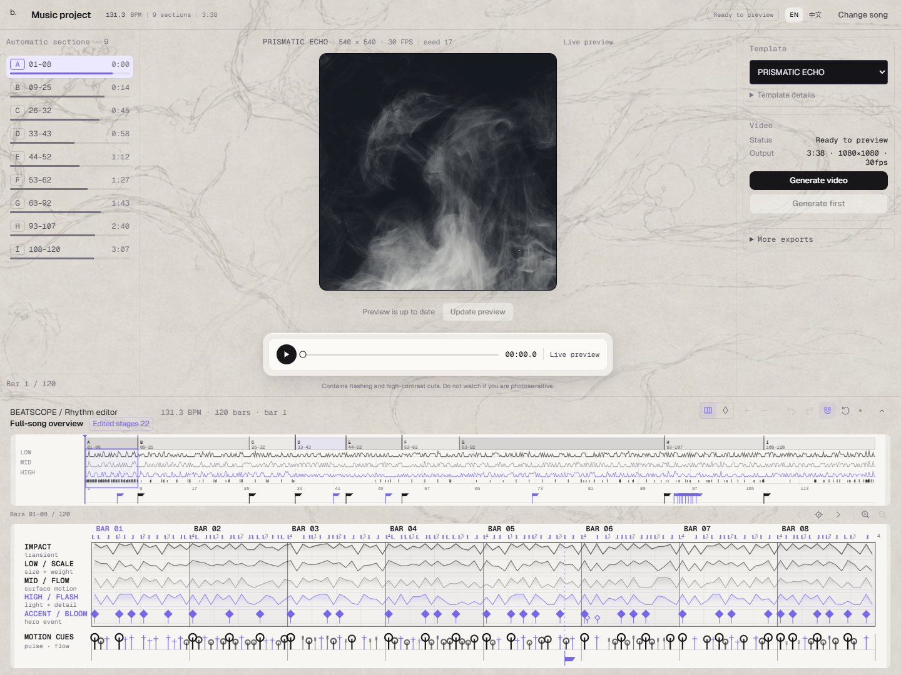

# BeatScope

English | [简体中文](README.zh-CN.md)

[](https://github.com/chosuicide/beatscope/actions/workflows/ci.yml)
[](https://github.com/chosuicide/beatscope/releases/tag/v0.15.0)
[](LICENSE)

**Turn a song into a beat-synchronised film — or give its timing to a coding agent.**

BeatScope listens for beats, real transients, energy changes, tempo changes and repeated sections. Beathi Studio turns those measurements into a movie preview and a reusable timing package. Everything runs locally; your audio is not uploaded.

[](https://github.com/chosuicide/beatscope/releases/download/v0.15.0/Beathi-v0.15.0-prismatic-echo-demo.mp4)

**[▶ Watch the latest 8-second native render with audio](https://github.com/chosuicide/beatscope/releases/download/v0.15.0/Beathi-v0.15.0-prismatic-echo-demo.mp4)** — 1080×1080, 30 fps; this is a short verification sample, not the whole song.

## What you do

1. Upload a WAV, FLAC, MP3, OGG or M4A file.
2. Check the film preview, song structure and rhythm map.
3. Render a video, export MIDI/CSV, or give the `.beatscope` package to a coding agent.



## Download and run

### Windows

Download **[Beathi Studio v0.15.0](https://github.com/chosuicide/beatscope/releases/download/v0.15.0/Beathi-Studio-v0.15.0-windows-x64.zip)**, extract the whole ZIP, then double-click **Beathi Studio.exe**. It includes the analyser, Node.js, Playwright, FFmpeg and the template's material pack. Rendering uses Microsoft Edge on Windows 10/11.

### Python 3.10+

Download the wheel from the [v0.15.0 release](https://github.com/chosuicide/beatscope/releases/tag/v0.15.0), then run:

```powershell
pip install beatscope-0.15.0-py3-none-any.whl
beatscope serve --open
```

For Prismatic Echo, extract the separate [material pack](https://github.com/chosuicide/beatscope/releases/download/v0.15.0/Beathi-Materials-v0.15.0.zip) into your working directory, keeping its `materials/` folder. Alternatively set `BEATSCOPE_MATERIAL_ROOT` to that folder. Python movie rendering also needs Node.js, FFmpeg, Playwright and a supported browser; see [local rendering](docs/local-movie.md). The Windows portable download includes these tools and materials.

## Two useful outputs

### A film you can watch

Choose **Voxel Interference** for procedural glitch visuals or **Prismatic Echo** for grey, blue and red footage, mirrors, kaleidoscopes, contour trails and sparse moving negatives. Both render the full song to MP4 at 1080×1080, 30 fps. The live preview uses 540×540.

Edit stage boundaries and add, move or mute cue markers on the rhythm graph, with undo/redo and optional snapping. Edits save immediately; **Update preview** applies them to the film. Exports and renders always use the latest saved edit plan, even while the preview is stale. [Template guide](docs/material-template.md).

Prismatic Echo now composites on the GPU and prefers hardware encoding. In one RTX 5060 Laptop 8-second comparison, rendering time fell about 24% and cumulative browser CPU time about 25%. Unsupported GPUs use the existing Canvas path. [Measured results and limits](docs/prismatic-gpu-composite.md).

### Timing a coding agent can use


Export the `.beatscope` package, then give it to an agent together with your footage, images or references. The package contains measured timing—not a fixed visual style—so the agent can build something new without guessing where the music hits.

In **More exports**, download the Agent ZIP and choose **Copy Agent instructions**. Give the Agent the original song and your task; assets and references are optional. If both direction and asset authorization are missing, it asks once. Existing projects resume from accepted requirements, assets, `score.json` and the latest saved `edit-plan.json`; new projects follow the package workflow. References can guide motion or material treatment separately. [Step-by-step handoff](docs/agent-handoff.md).

```text
your song
   ↓
BeatScope measures the timing
   ↓
.beatscope package + your media + your idea
   ↓
coding agent creates the visual
```

## What BeatScope measures


- beats, bars and tempo changes;
- original onset timestamps—the sound is never moved onto a prettier grid;
- LOW / MID / HIGH spectral activity;
- neutral repeated sections such as A / B / A′;
- optional response ordering for dense songs, so consumers do not react to everything.

BeatScope does **not** pretend to know that a sound is a kick, snare or 808. It reports evidence and lets the renderer decide what to do with it.

<details>
<summary><strong>What is inside the Agent package?</strong></summary>

The package includes `rhythm-map.json`, MIDI and CSV views, a deterministic JavaScript runtime, a self-checking probe, member hashes, short Agent instructions and a small reference-inspection/comparison helper. It does not include the source audio, reference files, assets, a visual template or a pre-written creative task. The helper's structural checks do not judge artistic quality.

`response_relevance` only ranks existing onsets. It is not a probability, confidence score or claim about musical truth; no onset is created, deleted or moved.

</details>

## For developers

```powershell
git clone https://github.com/chosuicide/beatscope.git
cd beatscope
python -m venv .venv
.\.venv\Scripts\Activate.ps1
pip install -e ".[dev,mcp]"
beatscope serve --open
```

BeatScope also provides:

- a local stdio MCP server for analysis and bounded timing queries;
- seven browser WebMCP tools inside Beathi Studio;
- deterministic runtime helpers for browser workers and offline renderers;
- reference consumers for Canvas, Three.js and Remotion;
- `beatscope validate-handoff <package.zip>` checks the timing package;
  `beatscope validate-consumer <consumer-dir>` checks a declared generated consumer.
  Neither check judges whether its visuals match a reference.

Read more: [Agent handoff](docs/agent-handoff.md) · [movie renderer](docs/local-movie.md) · [MCP](docs/mcp.md) · [WebMCP](docs/webmcp-studio.md) · [Agent Skill](skills/beatscope-visualizer/SKILL.md)

## Honest limits

- The current Studio ships two templates; Prismatic Echo uses a 51-item Pexels video/photo pack. Its media are licensed separately from the MIT code.
- Structure labels describe repetition, not Verse/Chorus or emotion.
- Real-world beat, tempo and structure evaluation still needs broader public benchmarks.
- MP3 support requires local libsndfile support or FFmpeg.
- Reference-led Agent creation is not proven across arbitrary styles. The [controlled evaluation](evaluations/reference-guided/README.md) records mixed first-pair results and incomplete follow-up validation.

## License

[MIT](LICENSE)
