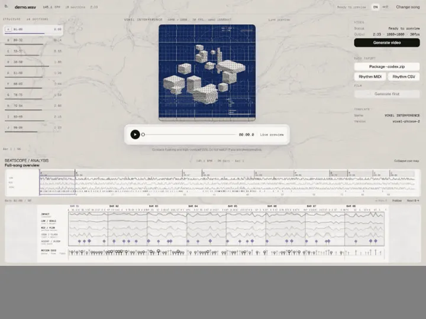
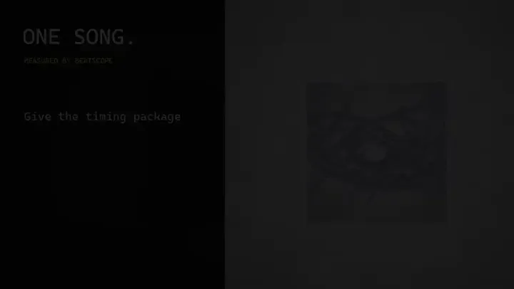
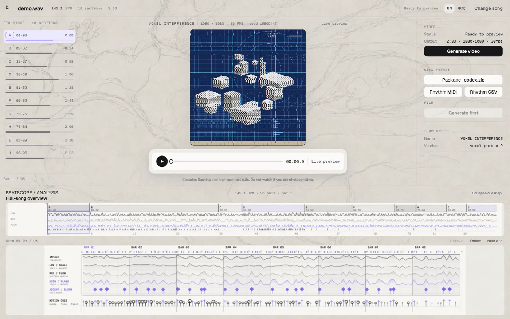
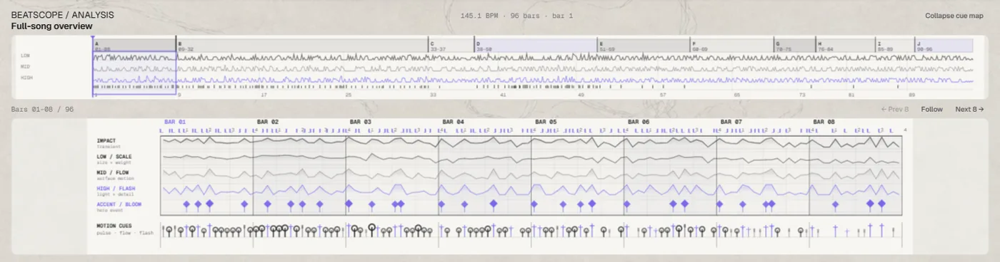

# BeatScope

[English](README.md) | 简体中文

[](https://github.com/chosuicide/beatscope/actions/workflows/ci.yml)
[](https://github.com/chosuicide/beatscope/releases)
[](LICENSE)

**上传一首歌，得到一支对拍成片，以及一份 Coding Agent 能自行校验的时序包。**

BeatScope 测量拍点、原始瞬态、多频段能量、变速段和重复结构；Beathi Studio 根据这些测量实时预览并确定性地渲染音乐视频。同一份事实也可以导出为自检式 `.beatscope` 包，或通过 MCP 查询。

它不会猜 kick、snare、808，也不会为了网格好看而把真实事件挪到另一个时刻。

[](docs/demo/beathi-studio.mp4)

## 下载即用

**Windows：**在 [v0.12.0 Release](https://github.com/chosuicide/beatscope/releases/tag/v0.12.0) 下载 `Beathi-Studio-v0.12.0-windows-x64.zip`，解压后双击 **Beathi Studio.exe**。便携包已带分析器和视频工具链，会在浏览器打开本地工作台；音频不会上传到服务器。

**Python 3.10+：**也可以从最新 GitHub Release 下载 wheel，或从源码安装：

```powershell
pip install beatscope-0.12.0-py3-none-any.whl
beatscope serve --open
```

参与开发：

```powershell
git clone https://github.com/chosuicide/beatscope.git
cd beatscope
python -m venv .venv
.\.venv\Scripts\Activate.ps1
pip install -e ".[dev]"
beatscope serve --open
```

打开 `http://127.0.0.1:8765`，选择 WAV、FLAC、MP3、OGG 或 M4A。待本地分析完成后，你可以：

1. 播放内置模板的实时预览；
2. 查看全曲结构与八小节 cue map；
3. 在本机浏览器和 FFmpeg 可用时渲染 MP4；
4. 为 DAW 或 Coding Agent 导出时序数据。

分析、预览和渲染都留在本机，请求产生的临时文件会在处理后删除。Windows 便携包已包含浏览器渲染 Worker 与 FFmpeg；源码安装可用 `beatscope doctor` 检查环境。

## 同一份时序，另一种视觉语言

[](docs/demo/agent-to-film.mp4)

内置模板是开箱即看的预览，不是作品上限。把导出的时序包交给 Coding Agent，说明你想做什么，再提供现有的视频、图片或视觉参考。包内 Skill 会要求 Agent 先校验测量结果，并主动询问缺少的创作输入，而不是擅自编造。**Dirt / Cold / Rings** 就是这样的成品：剪切与响应沿用 BeatScope 的真实时间戳，视觉系统则属于新作品。带声音的完整宣传片已附在 v0.12.0 Release。

## Studio 里有什么



Studio 刻意做成一个页面，而不是另一条剪辑时间线：

- **结构栏**：中性的 A / B / A′ 重复家族。它用于导航，不冒充主歌/副歌判断。
- **实时预览**：当前内置的 `VOXEL INTERFERENCE` 模板，由实测时间戳和一个确定性 seed 驱动。
- **成片**：按需输出 1080×1080、30 fps 的 MP4，预览与渲染共用同一份剪辑计划。
- **数据导出**：时序包、MIDI 和 CSV；不会把原始音频塞进包里。
- **分析区**：全曲导航，以及 impact、scale、flow、flash/bloom、motion 的八小节细节。



媒体元素是唯一播放时钟。预览、播放头、结构列表和两张节奏图都读取它；Seek 不会重启分析，也不会偷偷产生第二套时间线。

## 密集歌曲为什么不会让每一帧都动

密集混音里可能有很多有效 onset。即使每个时间戳都正确，让动画或剪辑响应全部事件仍会显得抽搐。BeatScope 保留所有原始事件，并增加可选的 `response_relevance` 排序；它来自有授权的人类谱面共识。

消费者给的是数量预算，而不是相信一个神奇阈值：

```js
const selection = track.responseBetween(startTime, endTime, 12);
// 12 个既有 onset，返回时恢复为时间顺序。
// response_relevance 只用于排序，不是概率或置信度。
```

它不会创建、删除、量化或移动 onset。缺少 sidecar 时，runtime 会明确说明用了时间顺序回退，不会假装模型存在。

## Agent 交接包

导出包携带测量结果和可执行的时序契约。它刻意不带风格、场景时间线、模板、原始音频或预写任务：拿到包的 Agent 仍应询问用户要做什么，以及有哪些素材可用。

```text
project.beatscope/
├── beatscope-package.json     入口、能力与逐文件哈希
├── rhythm-map.json            权威实测事实
├── response-relevance.json    对既有 onset id 的排序
├── rhythm.mid / rhythm.csv    同一事实的 DAW 与表格视图
├── visual-state.js            getVisualState() + getResponseEvents()
├── beatscope-runtime.js       确定性、无 DOM 的时序 runtime
├── consumer-probe.js          零依赖自检
├── worker-example.js          module Worker 适配器
├── AGENT.md / BEATSCOPE.md    阅读顺序与时序不变量
├── SKILL.md / references/     使用说明与 schema
└── LICENSE
```

```powershell
beatscope validate-handoff path\to\project.beatscope --checkpoints checkpoints.json
beatscope validate-consumer examples\canvas-particles --browser
beatscope validate-consumer examples\remotion-composition --offline
```

同一份冻结交接包已经驱动三个互不共享渲染器的参考消费者：

| Canvas 2D | Three.js | Remotion |
| --- | --- | --- |
|  |  |  |
| 零构建浏览器作品 | 固定 `three@0.169.0` 的雕塑 | 确定性离线合成 |
| [打开示例](examples/canvas-particles) | [打开示例](examples/threejs-geometry) | [打开示例](examples/remotion-composition) |

另一次全新上下文 Codex 实测只拿到了冻结任务与交接包，随后独立生成零依赖 Canvas 作品 **Orbital Notation**。它通过了浏览器播放、Seek、重放、确定性状态和 reduced-motion 检查，源代码无需人工返修。[运行记录](evaluations/agent-interoperability/runs/codex-canvas-2026-09-02.json) · [符合性表格](evaluations/agent-interoperability/conformance.md)

## 在浏览器里与工作室协作

在支持 WebMCP 的浏览器里，工作室会注册七个工具：Agent 可以查看已加载的歌曲、请求一组有界的原始响应时刻、解释某个镜头为什么在这里切、试听一段、以指定种子开始渲染，并准备时序包——全程拿不到原始音频，也不会跑第二套分析。按钮和工具走同一批函数；每一次会改动页面的调用都会出现在传送条上方的窄条里，试听后可以 Restore。普通浏览器看不到任何新增界面。所有计算都留在用户本机；`response_relevance` 是排序值，绝不是概率或置信度。契约、限额与本地验证步骤见 [docs/webmcp-studio.md](docs/webmcp-studio.md)。

## MCP

```powershell
pip install -e ".[mcp]"
beatscope-mcp
```

本地 stdio 服务提供六个稳定工具：

| 工具 | 用途 |
| --- | --- |
| `beatscope_list_projects` | 列出本地缓存分析 |
| `beatscope_get_project` | 读取时序、来源和结构摘要 |
| `beatscope_analyze_audio` | 带进度与取消能力地分析本地音频 |
| `beatscope_get_visual_state` | 查询某一时刻的实测事实 |
| `beatscope_get_events` | 查询有界时间窗，并可按预算选择响应事件 |
| `beatscope_export_package` | 原子写入交接包 |

允许访问的路径受 `BEATSCOPE_ALLOWED_ROOTS` 限制。完整契约与客户端设置见 [docs/mcp.md](docs/mcp.md)。

## 数据怎样流动

```text
本地音频
   └─ 测量
      ├─ 精确拍点 + 变速段
      ├─ 原始 onset + LOW / MID / HIGH 能量
      ├─ 对同一批 onset 的可选排序
      └─ 中性结构 + 边界
          ├─ Beathi 预览与 MP4 渲染
          ├─ 全曲图与八小节图
          ├─ MIDI / CSV / .beatscope 导出
          └─ runtime 与 MCP 查询
```

分析器负责事实，消费者负责表现。正因为这样，交互播放器、离线渲染器和 Coding Agent 才能在不共享视觉代码的前提下解析同一个音乐时刻。

<details>
<summary><strong>证据与 benchmark 边界</strong></summary>

音频回归套件含 11 个有冻结真值的合成场景，包括密集、稀疏、离网格、突然/渐进变速、静音和八度陷阱。突然变速场景目前达到 beat F1 `1.00`，两段速度误差为 `0.185 / 0.325 BPM`，变速点误差 `0.01 s`。这些 fixture 用来防回归，不是“真实世界 MIR 已全面准确”的宣传。

响应排序器另有封存测试集：23 首歌曲、144 张有授权的 StepMania 谱面，来源在开发阶段完全隔离。相对只看 onset strength 的基线，成对一致率提升 `0.0238`、NDCG@10 提升 `0.2983`、预算内召回提升 `0.0847`；成对提升的 95% bootstrap 区间为 `[0.0146, 0.0336]`。它衡量的是与游戏谱面式人类共识的一致程度，不是普适“音乐重要性”。

结构另有十种编排 benchmark。常规 CI 只保留三道相互独立的门：Ubuntu 全量契约、Windows Python 3.10 重点兼容性，以及真实浏览器中的 Studio/WebMCP 往返。Windows 便携版仍会在每次发布前单独完成分析与视频渲染冒烟。

</details>

## 命令与文档

```powershell
beatscope serve
beatscope analyze song.wav
beatscope doctor
beatscope benchmark
beatscope benchmark-structure
```

- [本地 Studio 与电影渲染器](docs/local-movie.md)
- [Studio 设计与失败契约](docs/design/movie-studio.md)
- [公开节拍基准](docs/public-benchmark.md)
- [MCP 服务](docs/mcp.md)
- [冻结的跨 Agent 任务](evaluations/agent-interoperability/TASK.md)
- [仓库 Skill](skills/beatscope-visualizer/SKILL.md)

开发门禁：

```powershell
pytest -q
npm run test:js
npm run check:web-deps
npm run typecheck --prefix web-src
npm run build --prefix web-src
```

## 已知边界

- BeatScope 提供确定性时序，不替代完整艺术指导。
- 结构家族只描述重复关系，不识别情绪、歌词或歌曲段落名称。
- 分析器报告瞬态与频段证据，不判断乐器身份。
- `response_relevance` 是排序值，不是概率、置信度或音乐真理。
- MP3 需要本地 libsndfile 支持或 FFmpeg。
- 很长、渐进或结构含糊的歌曲可能诚实地只得到一个结构段。
- Studio 当前内置一套成片模板；时序包刻意与渲染器解耦。
- 拍点、速度与结构的准确度仍主要由合成 fixture 守住。更广的公开真实音乐评测仍待补齐。

## 许可证

[MIT](LICENSE)
