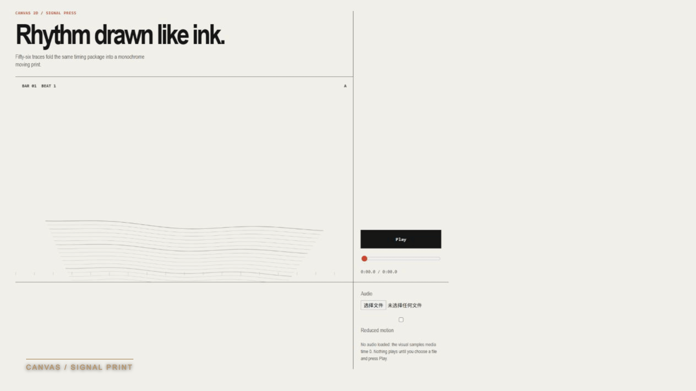
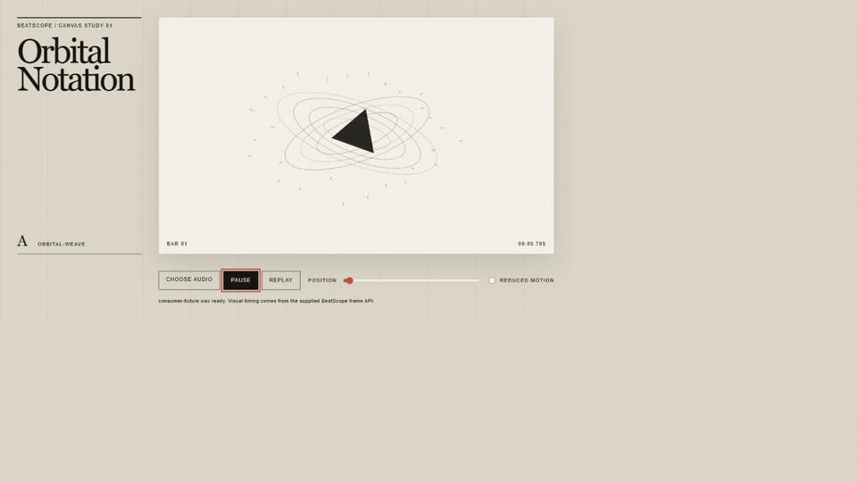

# BeatScope

[English](README.md) | 简体中文

[](https://github.com/chosuicide/beatscope/actions/workflows/ci.yml)
[](https://github.com/chosuicide/beatscope/releases)
[](LICENSE)

**把可测量的音乐时序交给 Coding Agent：精确拍点、原始事件、结构，以及由调用方限定数量的响应时刻。**

BeatScope 同时提供三个部分：

- **Studio**：上传一首歌，直接得到一支音乐视频：BeatScope 测量音乐，工作室依据这些测量剪出一支确定性的片子，并在页面里播放。
- **时序包**：把同一份测量导出为不含原始音频、可移植且能自检的 `.beatscope` 交接包。
- **Runtime + MCP**：让视觉项目或 Coding Agent 读取同一份事实，或按固定预算选择响应点，无需重新分析音乐。

它报告时间、瞬态强度、频段分布和中性的重复结构，但**不会**把不确定事件硬说成 kick、snare 或 808。

## 给响应数量设预算，而不是追着每个 onset 动

密集歌曲里可能同时存在很多有效瞬态。即使时间戳都对，让动画或剪辑响应全部事件仍会显得抽搐。BeatScope v0.11 保留完整原始事件层，并新增可选的 `response_relevance` 排序；它来自有授权的人类谱面共识。

最终选择仍由消费者决定。调用方给出数量，而不是相信一个神奇阈值：

```js
const selection = track.responseBetween(startTime, endTime, 12);
// selection.events：12 个原有 onset，返回前恢复为时间顺序
// response_relevance：只用于排序，不是概率或置信度
```

它不会创建、删除、量化或移动 onset。缺少 sidecar 时，同一个调用会明确返回按时间顺序回退，而不会伪装成用了模型。

## 三分钟开始

需要 Python 3.10 或更高版本。

```powershell
git clone https://github.com/chosuicide/beatscope.git
cd beatscope
python -m venv .venv
.\.venv\Scripts\Activate.ps1
pip install -e ".[dev]"
beatscope serve
```

打开 `http://127.0.0.1:8765`，选择 WAV、FLAC、MP3、OGG 或 M4A 文件：工作室会测量它、剪出片子并直接播放。分析和渲染都在本地完成，请求产生的临时文件会在处理后清理。

## 一份时序包，不同的视觉语言

下面三个参考作品读取同一份冻结交接包。它们只共享时序事实，不共享组件、渲染器或视觉隐喻。

[](docs/demo/consumer-showcase.mp4)

| Canvas 2D | Three.js | Remotion |
| --- | --- | --- |
|  |  |  |
| 零构建交互作品 | 固定 `three@0.169.0` 的雕塑 | 确定性离线合成 |
| [打开示例](examples/canvas-particles) | [打开示例](examples/threejs-geometry) | [打开示例](examples/remotion-composition) |

三者都只读取一个函数：

```js
import { getVisualState } from "./fixture.beatscope/visual-state.js";

function render(time) {
  const facts = getVisualState(time);
  // facts：小节、拍、相位、LOW/MID/HIGH、onset、accent、结构分段
  // 视觉方向（疏密、流动、边界包络、配色）由每个消费者自己编写——包里只有测量结果，没有场景。
}
```

交互播放器使用 `audio.currentTime`，离线渲染器使用 `frame / fps`。暂停、Seek、重放和重复渲染都会把同一时刻解析为同一状态。

## 一次全新上下文的 Codex 实测

第四个作品并非在 BeatScope 仓库上下文中设计。一个全新的 Codex 任务只拿到了冻结需求、检查点和导出的交接包，随后独立生成了零依赖 Canvas 作品 **Orbital Notation**。



上面的动图是在合成 fixture 音频真实播放时录制的。该次运行通过全部 5 个必需验证层，包括浏览器播放、Seek、重放、确定性状态和 reduced-motion 时序。生成代码没有经过人工修复；操作者只向验证器提供了仓库固定的浏览器测试路径。[查看运行记录](evaluations/agent-interoperability/runs/codex-canvas-2026-09-02.json)，或[查看自动生成的符合性表格](evaluations/agent-interoperability/conformance.md)。

**证据状态：** 已记录 1 个全新上下文 Coding Agent 产品。只有第二个独立产品通过同一冻结任务后，项目才会声明 “validated across Coding Agents”。

## 上传后发生了什么

```text
本地音频
   │
   ├─ 拍点 + 变速段
   ├─ 瞬态 + LOW / MID / HIGH 能量
   ├─ 基于同一批瞬态的可选响应排序
   └─ 中性结构：A / B / A′ + 边界
                │
                ├─ Studio 播放器与八小节 cue map
                ├─ 确定性视觉配方 + 场景时间线
                ├─ MCP 查询
                └─ 自描述交接包
```

### Studio

打开 `http://127.0.0.1:8765`，丢进一首歌，工作室会测量它、依据测量剪出一支片子并直接播放——一个页面，没有剪辑时间线。同一个页面负责导出下面的时序包。细节见 [docs/local-movie.md](docs/local-movie.md)。

### 交接包

每次导出都会带上节奏地图、确定性 runtime、Agent 路由说明、Skill、完整性哈希和零依赖探针；并且刻意**不含任何视觉层**：没有配方、没有场景时间线、没有风格、没有任务陈述，因为视觉是消费者自己的决定，而一个预先定好视觉的包会让 agent 不再去问用户想要什么。

```text
project.beatscope/
├── beatscope-package.json     路由清单：入口、探针、能力、摘要、逐成员 sha256
├── README.md                  文件清单、刻意不含的东西、谁是权威
├── AGENT.md                   契约：时钟、纯度、禁令、需要与用户确认的问题
├── rhythm-map.json            实测事实（权威）
├── rhythm.mid / rhythm.csv    同一份事实，给 DAW 或表格
├── response-relevance.json    只用于排预算的排序侧车（另有 -data.js 副本）
├── visual-state.js            getVisualState(time)、getResponseEvents(start, end, budget)
├── beatscope-runtime.js       访问器所依赖的共享运行时
├── worker-example.js          module Worker 适配器
├── consumer-probe.js          自检：node consumer-probe.js .
├── BEATSCOPE.md               时间不变量
├── SKILL.md、references/schema.md
└── LICENSE
```

交接包绝不携带原始音频。`response-relevance.json` 只包含 onset id 和有界排序值，不会提供替代时间戳。消费者可以先验证路径、manifest、哈希、可执行模板、检查点和时钟语义，再运行包内 JavaScript。

```powershell
beatscope validate-handoff path\to\project.beatscope --checkpoints checkpoints.json
beatscope validate-consumer examples\canvas-particles --browser
beatscope validate-consumer examples\remotion-composition --offline
```

## MCP：不打开 Studio 也能查询音乐

```powershell
pip install -e ".[mcp]"
beatscope-mcp
```

本地 stdio 服务提供六个工具：

| 工具 | 用途 |
| --- | --- |
| `beatscope_list_projects` | 查找本地缓存的分析项目 |
| `beatscope_get_project` | 读取时序、来源和结构摘要 |
| `beatscope_analyze_audio` | 带进度与取消能力地分析本地音频 |
| `beatscope_get_visual_state` | 查询某一时刻的测量事实——即包里的 `getVisualState(time)`，改由 MCP 提供 |
| `beatscope_get_events` | 查询时间窗内的事实；也可用 `response_budget` 选择排序后的原时刻 onset |
| `beatscope_export_package` | 原子写入可移植交接包 |

路径受 `BEATSCOPE_ALLOWED_ROOTS` 限制，分析和查询都留在本机。完整配置见 [MCP 契约与客户端设置](docs/mcp.md)。

## 为什么它不会越播越偏

BeatScope 把信息分为三层，但只有前两层会被交付：

1. **事实**：拍点时间、瞬态和多频段能量。
2. **语义**：变速段、小节、量化 cue、结构边界和重复家族。
3. **表现**：动效预算、结构场景和过渡包络。这一层是消费者自己的决定：它不出现在包里，不经 MCP 提供，也不作为任务被写死，所以拿到测量结果的一方仍然可以去问用户想要什么。

零依赖 JavaScript runtime 不接触 DOM、Audio、Canvas 或墙上时钟。播放器、MCP bridge、导出包和参考消费者查询的是同一套模型，而不是各自保存一份略有差异的歌曲解释。

<details>
<summary><strong>准确度、确定性与 benchmark 门槛</strong></summary>

音频 benchmark 含 11 个带冻结真值的合成场景：固定、密集、稀疏、离网格、重低音、静音、突然变速、渐变速度、微漂移和八度陷阱。当前全部门槛通过。tempo-change 的拍点 F1 从 `0.16` 提升到 `1.00`；两个速度段误差为 `0.185 / 0.325 BPM`，变速点误差 `0.01 s`，接缝没有漏拍或多拍。

这些确定性合成 fixture 用精确真值守住回归，不代表项目已经全面证明真实音乐上的 MIR 准确率。

v0.11 的响应排序器另有封存测试集：23 首歌曲、144 张有授权的 StepMania 谱面，来源在开发阶段完全隔离。相对只看 onset strength 的基线，成对一致率提升 `0.0238`、NDCG@10 提升 `0.2983`、预算内召回提升 `0.0847`；成对提升的 95% bootstrap 区间为 `[0.0146, 0.0336]`。这些数字衡量的是与游戏谱面式人类共识的一致程度，不是普适的“音乐重要性”。

结构另有十种编排 benchmark。当前 Studio 另有确定性时序、剪辑计划、编码失败安全、TypeScript 与生产构建门禁。CI 在 Windows、Ubuntu、Python 3.10 与 3.12 上运行，并包含固定浏览器消费者和 Remotion 离线证据任务。

```powershell
beatscope benchmark
beatscope benchmark-structure
```

</details>

## 常用命令

```powershell
beatscope serve
beatscope rhythm song.wav --output rhythm.json
beatscope doctor
beatscope benchmark
```

针对密集混音，可通过 `.[high-quality]` 使用可选的 Beat This 与 Demucs 输入；选择 CUDA 后不会静默退回 CPU。

## 文档

- [MCP 服务与客户端设置](docs/mcp.md)
- [消费者符合性结果](evaluations/agent-interoperability/conformance.md)
- [冻结的跨 Agent 任务](evaluations/agent-interoperability/TASK.md)
- [仓库 Skill](skills/beatscope-visualizer/SKILL.md)
- [版本发布](https://github.com/chosuicide/beatscope/releases)

## 开发验证

```powershell
pytest -q
npm run test:js
beatscope validate-handoff examples\shared\fixture.beatscope --checkpoints examples\shared\checkpoints.json
```

仓库包含 Python、JavaScript、浏览器、包完整性、MCP、benchmark 和跨平台回归测试。CI 只重放已经提交的证据，不会在流水线里联系远程 Agent。

## 已知边界

- BeatScope 提供确定性音乐时序，不替代完整的艺术指导。
- 结构家族描述重复关系，不识别情绪、歌词或主歌/副歌。
- 内置分析器报告瞬态与频段证据，不判断乐器身份。
- `response_relevance` 是从谱面共识学到的预算排序值，不是概率、置信度或音乐真理。
- 导出包和示例不包含原始音频。
- MP3 需要本地 libsndfile 支持或 FFmpeg。
- 很长、渐变或结构含糊的歌曲可能诚实地只得到一个结构段。
- 拍点、速度与结构的准确度仍主要依赖确定性合成 fixture。响应排序器目前只有一个有授权的 StepMania 封存来源；更多曲风、格式和公开 MIR 数据集仍待补齐。

## 许可证

[MIT](LICENSE)
