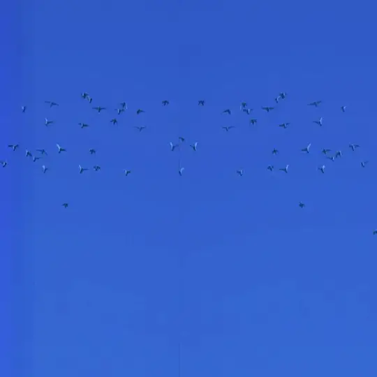
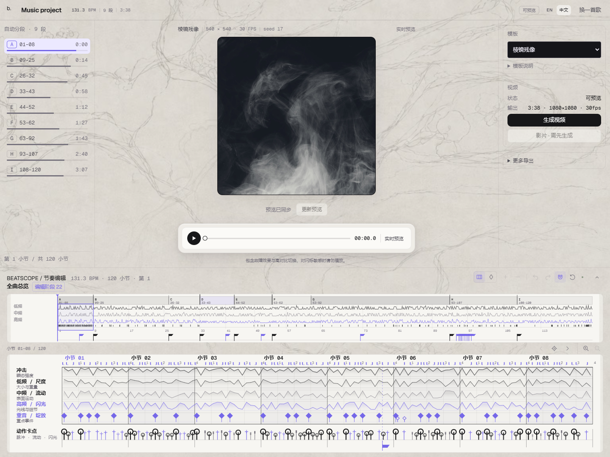
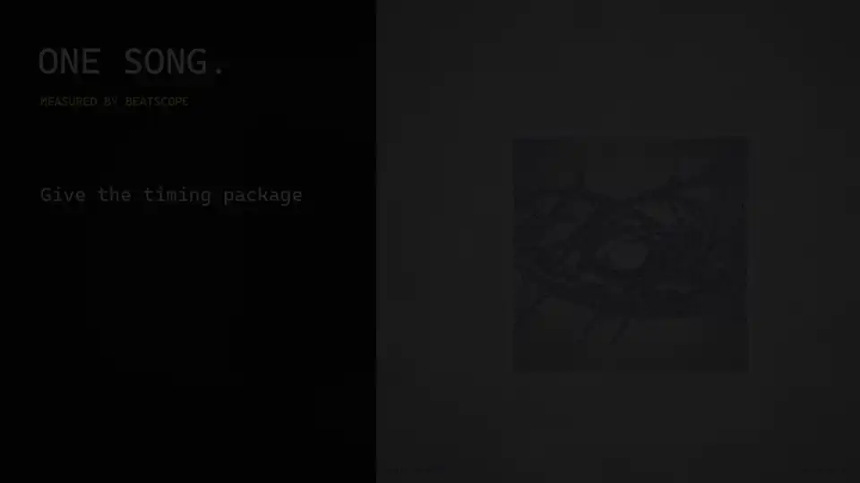
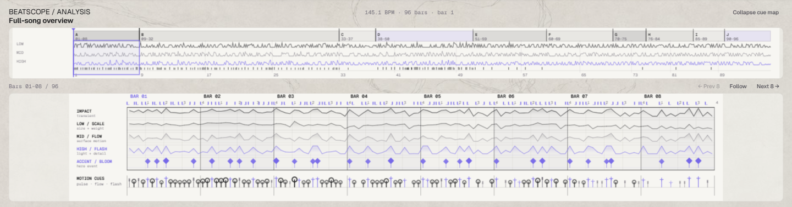

# BeatScope

[English](README.md) | 简体中文

[](https://github.com/chosuicide/beatscope/actions/workflows/ci.yml)
[](https://github.com/chosuicide/beatscope/releases/tag/v0.16.0)
[](LICENSE)

**把任何一首歌变成踩准节拍的 MV；也可以把准确时序交给 Coding Agent。**

BeatScope 会测量拍点、真实瞬态、能量变化、速度变化和重复段落。Beathi Studio 用这些数据生成影片预览，也能导出一份可复用的时序包。所有处理都在本机完成，音频不会上传。

[](https://github.com/chosuicide/beatscope/releases/download/v0.16.0/prismatic-echo-ii-v016.mp4)

**[▶ 观看「棱镜残像 II」8秒实渲片段（带音频）](https://github.com/chosuicide/beatscope/releases/download/v0.16.0/prismatic-echo-ii-v016.mp4)** — 720×720、30fps，截自《Shattered Heartbeat》全曲渲染。

## 你只需要做三步

1. 上传 WAV、FLAC、MP3、OGG 或 M4A 音频。
2. 选一套模板，想用自己的图片或视频就拖进来，再查看影片预览、歌曲结构和节奏图。
3. 渲染方形、横屏或竖屏视频、导出 MIDI/CSV，或者把 `.beatscope` 包交给 Coding Agent。



## 下载与运行

### Windows

下载 **[Beathi Studio v0.16.0](https://github.com/chosuicide/beatscope/releases/download/v0.16.0/Beathi-Studio-v0.16.0-windows-x64.zip)**，完整解压后双击 **Beathi Studio.exe**。便携包包含分析器、Node.js、Playwright、FFmpeg 和模板素材；视频渲染使用 Windows 10/11 自带的 Microsoft Edge。

### Python 3.10+

从 [v0.16.0 Release](https://github.com/chosuicide/beatscope/releases/tag/v0.16.0) 下载 wheel，然后运行：

```powershell
pip install beatscope-0.16.0-py3-none-any.whl
beatscope serve --open
```

使用「棱镜残像 I / II」时，将独立的[素材包](https://github.com/chosuicide/beatscope/releases/download/v0.16.0/Beathi-Materials-v0.16.0.zip)解压到当前工作目录，保留 `materials/` 文件夹；也可以用 `BEATSCOPE_MATERIAL_ROOT` 指定它。Python 安装的视频渲染另需 Node.js、FFmpeg、Playwright 和支持的浏览器，见[本地渲染说明](docs/local-movie.md)。Windows 便携版已包含工具和素材。

## 两种实用输出

### 直接观看的影片

四套模板：

- 「体素干扰」：程序化故障画面。
- 「棱镜残像 I」：灰白、蓝、红素材，结合镜像、万花筒、同色轮廓拖影和少量动态负片。
- 「棱镜残像 II」：在 I 的基础上，每两小节来一段采样切片：重复切片、错位画面和单帧闪白，其余时间素材正常流动。
- 「粉彩花信」：花卉实拍被实时画成油彩、墨线和粉彩笔触。[粉彩花信说明](docs/pastel-bloom.md)。

「棱镜残像」和「粉彩花信」都能用你自己的图片和视频：拖进来放到素材时间线上，模板效果会叠在上面；可选的场景配色让整体颜色统一。

所有模板都能导出全曲 MP4，30fps，画幅可选 1:1、16:9、9:16，分辨率 720p 或 1080p。每种画幅都按画面重新构图，不是从方形裁出来的。

在节奏图上编辑阶段边界，添加、移动或静音卡点，支持撤销、重做和可选吸附。编辑立即保存，点击「更新预览」后应用到画面；导出包和正式渲染始终使用最新保存的编辑计划。[模板说明](docs/material-template.md)。

「棱镜残像」使用 GPU 合成、硬件编码与缓存复用，优化渲染流程。设备不满足 GPU 功能要求时，会自动使用 Canvas 渲染。

### Coding Agent 能使用的时序



导出 `.beatscope` 包，再把它与你的影像、图片或参考作品一起交给 Agent。包里只有测量所得的时序，没有锁死视觉风格，因此 Agent 可以创造新作品，也不需要猜音乐在什么时候落下。

在「更多导出」中下载 Agent ZIP，并点「复制给 Agent 的说明」。提供原曲和任务即可，素材与参考是可选项；创作方向和素材授权都不明确时，Agent 会合并询问一次。已有项目复用认可的需求、素材、`score.json` 和最新 `edit-plan.json`；新项目按包内流程创建。参考可以分别用于动效或素材处理。[完整交接步骤](docs/agent-handoff.md)。

```text
你的歌曲
   ↓
BeatScope 测量准确时序
   ↓
.beatscope 包 + 你的素材 + 你的想法
   ↓
Coding Agent 制作视觉作品
```

## BeatScope 会测量什么



- 拍、小节和速度变化；
- 原始瞬态时间——不会为了整齐把声音吸附到拍格；
- LOW / MID / HIGH 三段能量；
- A / B / A′ 这类中性的重复结构；
- 密集歌曲的可选响应排序，避免画面什么都响应。

BeatScope 不会假装知道某个声音一定是底鼓、军鼓或 808。它只提供可验证的事实，由渲染器决定如何表现。

<details>
<summary><strong>Agent 包里有什么？</strong></summary>

其中包含 `rhythm-map.json`、MIDI、CSV、确定性 JavaScript runtime、自检脚本、成员哈希、简短的 Agent 使用说明，以及抽帧/并排对照辅助脚本。它不包含源音频、参考视频、素材或视觉模板，也不会替用户预设创作任务。辅助脚本只能检查证据是否齐全，不能自动评定美感。

`response_relevance` 只负责给已有瞬态排序。它不是概率、置信度或“音乐真理”；任何瞬态都不会被新建、删除或移动。

</details>

## 开发者入口

```powershell
git clone https://github.com/chosuicide/beatscope.git
cd beatscope
python -m venv .venv
.\.venv\Scripts\Activate.ps1
pip install -e ".[dev,mcp]"
beatscope serve --open
```

项目还提供：

- 本地 stdio MCP 服务，用于分析和有界时序查询；
- Beathi Studio 内的七个 WebMCP 工具；
- 可用于 Web Worker 和离线渲染器的确定性 runtime；
- Canvas、Three.js 和 Remotion 参考消费者。
- `beatscope validate-handoff <package.zip>` 核对时序包；`beatscope validate-consumer <consumer-dir>` 核对声明过的消费者。二者都不能证明作品符合视觉参考。

继续阅读：[Agent 交接](docs/agent-handoff.md) · [影片渲染器](docs/local-movie.md) · [MCP](docs/mcp.md) · [WebMCP](docs/webmcp-studio.md) · [Agent Skill](skills/beatscope-visualizer/SKILL.md)

## 目前的限制

- Studio 内置四套模板；「棱镜残像 I / II」使用51份 Pexels 视频/图片素材，「粉彩花信」使用10段 Pexels 花卉视频。素材许可与 MIT 源码许可分开，署名见素材包和粉彩花信说明。
- 结构字母只表示重复关系，不代表主歌、副歌或情绪。
- 真实音乐上的拍点、速度和结构评测仍需要更广泛的公开基准。
- MP3 支持依赖本机 libsndfile 或 FFmpeg。
- Agent 对任意风格参考的稳定还原仍未证明；[受控评测](evaluations/reference-guided/README.md)记录了首轮混合结果，后续修正验证尚不完整。

## 许可证

[MIT](LICENSE)
